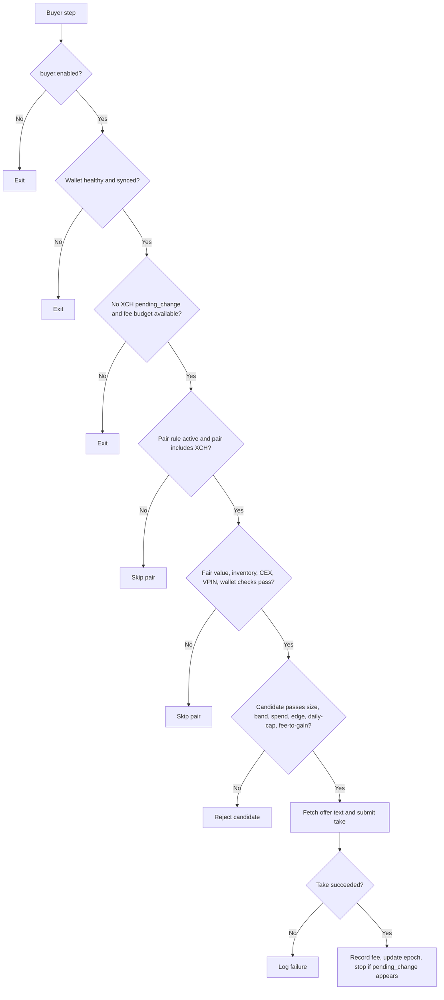

# Buyer Operator Runbook

Date: 2026-04-13

## Purpose

This is the short operator-facing runbook for Step 9e buyer behavior.

Use this when:

1. Buyer should be taking offers but is not.
2. You want to enable buyer safely.
3. You want to know which gate to inspect first.

## Current Live State

Buyer is currently enabled in `config.yaml` and `buyer.yaml`.

Operational meaning:

1. The full Step 9e buyer tree is now live instead of collapsing at `BUY-B01`.
2. Both ask-side and bid-side buyer paths on `XCH/wUSDC.b` are configured.
3. Ask and bid rules on the same pair still share cooldown and daily-cap state.

## Buyer Decision Order

Buyer evaluates in this order:

1. Global gates.
2. Pair gates.
3. Candidate scoring gates.
4. Offer fetch and submission.
5. Post-take settle stop.

## Quick Decision Tree

## Global Gates

Buyer exits before any pair processing when any of these are true:

1. Wallet circuit breaker open.
2. Recovery mode active and `respect_recovery_mode = true`.
3. Flash crash state not Normal and `respect_flash_crash = true`.
4. Wallet not synced.
5. XCH `pending_change > 0`.
6. Recommended fee is zero because fee budget is exhausted.
7. XCH spendable is below the hard 0.25 XCH preflight.
8. Buyer fee-budget slice is exhausted.

## Pair Gates

A pair is skipped when any of these are true:

1. Pair rule disabled.
2. Pair cooldown still active.
3. Pair daily cap already reached.
4. Pair does not include XCH.
5. Fair value missing.
6. Inventory ratio outside the allowed zone.
7. No CEX reference or CEX age too old.
8. Fair price too far from CEX.
9. VPIN too high.
10. Wallet IDs cannot be resolved.
11. Spend wallet has pending change.

## Candidate Gates

Even after the pair passes, the candidate still fails if any of these are true:

1. Base size is outside `[min_take_units, max_take_units]`.
2. Discount is below the derived minimum actionable floor.
3. Discount is above the top of the actionable window (`derived floor + band_bps`).
4. Spend wallet cannot fund the take.
5. Net edge is below `min_edge_bps` after buffers and fee drag. This is now mostly a defensive fallback, not the normal way the branch rejects candidates.
6. FeeTracker rejects the fee-to-gain ratio.
7. The candidate would exceed the pair daily cap.
8. Dexie offer is stale or missing bech32.
9. Wallet `take_offer` fails.

## Current Buyer Parameters

The current configured buyer rules are narrow and deliberate:

1. Pair: `XCH/wUSDC.b`
2. Sides: `ask` and `bid`
3. Slack above derived floor: `40 bps`
4. Minimum net edge: `12 bps`
5. Size range: `0.05` to `0.25 XCH`
6. Daily cap: `5.0 XCH` shared by both sides on the pair
7. CEX premium cap: `50 bps`
8. Inventory cap: `0.65`
9. VPIN cap: `0.70`

## Fast Triage Sequence

When buyer does not trade, inspect in this order:

1. Is buyer enabled?
2. Did Step 9c or recovery already create `pending_change`?
3. Is XCH spendable above 0.25?
4. Is the fee budget already exhausted?
5. Is the pair in cooldown or at daily cap?
6. Is CEX data present and fresh?
7. Is inventory already too base-heavy?
8. Did the candidate fail the spend-balance or net-edge test?
9. Did Dexie or wallet submission fail?

## Blackhole Notes For Buyer

These are current structural facts, not temporary market conditions:

1. Non-XCH buyer pairs cannot trigger because the current implementation skips
   any pair where neither side is XCH.
2. Buyer no longer has the old structural dead zone. The engine now derives the
   minimum actionable discount floor from fees, buffers, `min_edge_bps`, and
   optional relist credit, then treats `band_bps` as slack above that floor.

## Safe Enablement Sequence

1. Keep `max_takes_per_block = 1` while the new bid-side rule proves out.
2. Watch for `BUY-B06`, `BUY-B11`, `BUY-B12`, and `BUY-B25` concentration in metrics.
3. If the bid rule rarely fires, verify the inventory ratio actually spends time above the sell floor.
4. Run the blackhole checker on a schedule so config drift does not silently reintroduce dormant paths.
