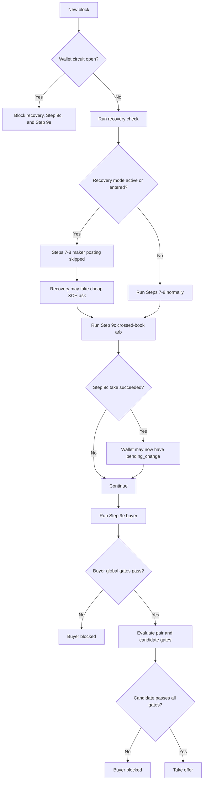

# Trade Decision Tree Scenarios

Date: 2026-04-13

## Purpose

This document tracks when the live system will trigger a trade, when it will
block a trade, and which decision branch is responsible.

It is intended to answer questions like:

1. Why did the bot take a trade on this block?
2. Why did the bot refuse to trade even though an opportunity appeared valid?
3. Which subsystem won when multiple trade paths were available?

## Scope

This document covers active trade decisions made by the engine:

1. XCH recovery taker flow in Step 6.5.
2. Crossed-book arbitrage in Step 9c.
3. Buyer flow in Step 9e.

This document does not cover passive maker fills from Step 8 offers, because
those fills are counterparty-triggered after our offers are already posted.

## Execution Order Per Block

The active decision tree runs in this order:

1. Step 6 risk limits and flash-crash state.
2. XCH recovery check and optional recovery take.
3. Steps 7-8 maker ladder and offer management.
4. Step 9c crossed-book arbitrage.
5. Step 9e buyer flow.

Important precedence rules:

1. Recovery runs before maker posting, so recovery can suppress Steps 7-8.
2. Crossed-book arbitrage still runs after recovery.
3. Buyer runs after Step 9c, so it sees pending_change and wallet state left by
   any earlier take.
4. Buyer is blocked by recovery mode by default.

## Top-Level Decision Tree

## Source-of-Truth Log Prefixes

Use these prefixes in the logs to identify which branch fired:

1. `[Recovery]` for recovery entry, exit, scan, and recovery takes.
2. `[Engine] Step 9c:` for crossed-book arbitrage.
3. `[Buyer]` for the Step 9e buyer path.
4. `[Engine] Steps 7-8 SKIPPED: XCH recovery mode active` when recovery blocks
   maker posting.

## Current Live Threshold Snapshot

These are the values currently driving the repo state:

### Recovery

1. `recovery.enabled = true`
2. `recovery.xch_low_threshold = 0.15 XCH`
3. `recovery.xch_recovery_target = 1.0 XCH`
4. `recovery.max_take_per_block_xch = 0.5 XCH`
5. `recovery.max_premium_bps = 100`
6. `recovery.cancel_on_enter = false`
7. `recovery.pair_allowlist = [XCH/wUSDC.b]`

### Crossed-Book Arbitrage

1. `arbitrage.crossed_book_enabled = true`
2. `arbitrage.crossed_book_min_edge_bps = 10`
3. `arbitrage.crossed_book_max_take_xch = 5.0`

### Buyer

1. `buyer.enabled = true`
2. `buyer.fee_budget_pct = 0.30`
3. `buyer.cooldown_blocks = 3`
4. `buyer.epoch_blocks = 4608`
5. `buyer.max_takes_per_block = 1`
6. `buyer.vpin_max = 0.70`
7. `buyer.max_cex_age_blocks = 10`
8. `buyer pair rules = XCH/wUSDC.b ask + bid`
9. `buyer.band_bps = 40`
10. `buyer.min_edge_bps = 12`
11. `buyer.min_take_units = 0.05`
12. `buyer.max_take_units = 0.25`
13. `buyer.daily_cap_units = 5.0`
14. `buyer.max_premium_over_cex_bps = 50`
15. `buyer.inventory_ratio_cap = 0.65`

### Global Constraints Relevant To Buyer

1. `strategy.min_profit_margin_bps = 35`
2. `strategy.xch_ask_throttle_enabled = true`
3. `strategy.xch_ask_throttle_caution_xch = 2.0`
4. `strategy.xch_ask_throttle_low_xch = 1.0`
5. `strategy.xch_ask_throttle_critical_xch = 0.35`
6. Hardcoded take preflight in Step 9c and Step 9e: `0.25 XCH spendable`

## System-Level Scenarios

| ID | Scenario | Outcome | Primary log prefix |
|---|---|---|---|
| SYS-01 | Wallet circuit breaker is open at block start | Recovery, Step 9c, and Step 9e are all blocked | `[Engine]` or `[Buyer]` |
| SYS-02 | Recovery mode is active | Steps 7-8 are skipped, recovery can still trade, Step 9c still runs, buyer is blocked by default | `[Engine]`, `[Recovery]`, `[Buyer]` |
| SYS-03 | Step 9c takes first and creates pending_change | Buyer usually blocks on pending_change later in the same block | `[Engine] Step 9c:` then `[Buyer]` |
| SYS-04 | `dry_run_` is true | Step 9c and buyer log candidates but do not submit takes | `[Engine] Step 9c:` or `[Buyer]` |

## Recovery Scenarios

### Triggered Recovery Trades

| ID | Conditions | Outcome |
|---|---|---|
| REC-T01 | Already in recovery mode, XCH still below target, acceptable ask appears this block, offer still active | Recovery takes one XCH ask |
| REC-T02 | Recovery enters this block, `cancel_on_enter = false`, CEX reference exists, acceptable ask exists, offer still active | Recovery can take on the same entry block |

### Recovery Blocked Or Suppressed

| ID | Conditions | Outcome |
|---|---|---|
| REC-B01 | XCH spendable >= `xch_low_threshold` while not already in recovery | Recovery does nothing |
| REC-B02 | XCH spendable is low but confirmed balance is healthy | Recovery does not enter; interpreted as UTXO locking, not real depletion |
| REC-B03 | Recovery entered and `cancel_on_enter = true` | Offers are cancelled first; acquisition is deferred until next block |
| REC-B04 | No CoinGecko XCH/wUSDC reference | Recovery blocks all takes |
| REC-B05 | Pair has no trusted CEX reference, such as XCH/BYC or XCH/DBX | Recovery skips that pair |
| REC-B06 | Ask price exceeds `max_premium_bps` over CEX | Candidate blocked |
| REC-B07 | Offer is stale, inactive, or Dexie lookup fails | Candidate blocked |
| REC-B08 | No acceptable asks found this block | Recovery stays active but no trade is taken |
| REC-B09 | XCH spendable >= `xch_recovery_target` while already in recovery | Recovery exits and no recovery trade is attempted |

## Crossed-Book Arbitrage Scenarios

### Triggered Crossed-Book Trades

| ID | Conditions | Outcome |
|---|---|---|
| ARB-T01 | Arbitrage enabled, crossed-book enabled, wallet circuit closed, pair has bid >= ask, edge >= min edge, spendable XCH preflight passes, offer still active | Step 9c takes the cheapest ask inside the cross |
| ARB-T02 | Same as ARB-T01 but spendable XCH is initially low, `cancel_worst_to_free = true`, and emergency cancel frees a coin | Step 9c still takes after liberation |

### Crossed-Book Blocked Or Suppressed

| ID | Conditions | Outcome |
|---|---|---|
| ARB-B01 | Arbitrage disabled, crossed-book disabled, Dexie unavailable, or wallet unavailable | Step 9c exits immediately |
| ARB-B02 | Wallet circuit open | Step 9c blocked |
| ARB-B03 | No two-sided market on the pair | No cross evaluation |
| ARB-B04 | Best bid < best ask | No cross, no trade |
| ARB-B05 | Cross exists but edge < `crossed_book_min_edge_bps` | Candidate blocked |
| ARB-B06 | Spendable XCH < 0.25 and no coin can be freed | Trade may be skipped or fail at submission time |
| ARB-B07 | Dry run active | Candidate logged only |
| ARB-B08 | Dexie offer lookup returns inactive or missing bech32 | Candidate blocked |
| ARB-B09 | Wallet `take_offer` RPC fails | No trade; error logged |

## Buyer Scenarios

### Triggered Buyer Trades

| ID | Conditions | Outcome |
|---|---|---|
| BUY-T01 | Buyer enabled, wallet synced, no XCH pending_change, spendable XCH >= 0.25, fee budget available, pair includes XCH, inventory inside cap, CEX fresh, VPIN acceptable, spend wallet funded, candidate inside size and actionable discount window, fee-to-gain gate passes, offer still active | Buyer takes the best candidate |
| BUY-T02 | Same as BUY-T01 but side is `bid` and the inventory ratio is low enough to allow selling base | Buyer takes a bid-side candidate |

### Buyer Blocked At Global Gates

| ID | Conditions | Outcome |
|---|---|---|
| BUY-B01 | `buyer.enabled = false` | Buyer step exits immediately |
| BUY-B02 | Wallet circuit breaker open | Buyer blocked |
| BUY-B03 | Recovery mode active and `respect_recovery_mode = true` | Buyer blocked |
| BUY-B04 | Flash crash state not Normal and `respect_flash_crash = true` | Buyer blocked |
| BUY-B05 | Wallet not synced or sync check fails | Buyer blocked |
| BUY-B06 | XCH `pending_change > 0` | Buyer blocked |
| BUY-B07 | Fee tracker returns 0 because fee budget is exhausted | Buyer blocked |
| BUY-B08 | XCH spendable < 0.25 XCH preflight | Buyer blocked |
| BUY-B09 | Buyer fee-budget slice is exhausted even if the global fee budget is not | Buyer blocked |

### Buyer Blocked At Pair Gates

| ID | Conditions | Outcome |
|---|---|---|
| BUY-B10 | Pair rule disabled | Pair skipped |
| BUY-B11 | Pair cooldown still active | Pair skipped |
| BUY-B12 | Pair daily cap already reached in current epoch | Pair skipped |
| BUY-B13 | Pair does not include XCH | Pair skipped by current implementation |
| BUY-B14 | Fair value is missing or non-positive | Pair skipped |
| BUY-B15 | Inventory ratio already above the buy cap or below the sell floor | Pair skipped |
| BUY-B16 | No CEX reference or CEX reference older than `max_cex_age_blocks` | Pair skipped |
| BUY-B17 | Fair-to-CEX premium exceeds `max_premium_over_cex_bps` | Pair skipped |
| BUY-B18 | VPIN > `vpin_max` | Pair skipped |
| BUY-B19 | Base or quote wallet ID cannot be resolved | Pair skipped |
| BUY-B20 | Spend wallet for the side has `pending_change > 0` | Pair skipped |

### Buyer Blocked At Candidate Gates

| ID | Conditions | Outcome |
|---|---|---|
| BUY-B21 | No competing offers on the target side | No candidates |
| BUY-B22 | Candidate base size < `min_take_units` or > `max_take_units` | Candidate blocked |
| BUY-B23 | Candidate discount is outside the derived actionable window: below the minimum actionable floor or above `min floor + band_bps` | Candidate blocked |
| BUY-B24 | Spend wallet lacks enough spendable balance for the notional | Candidate blocked |
| BUY-B25 | Defensive fallback: net edge after relist credit, fee drag, toxicity, and slippage is still below `min_edge_bps` after the actionable-window filter | Candidate blocked |
| BUY-B26 | FeeTracker fee-to-gain gate rejects the candidate | Candidate blocked |
| BUY-B27 | Candidate would push the pair above its daily cap | Candidate blocked |
| BUY-B28 | Dry run active | Candidate logged only |
| BUY-B29 | Dexie offer lookup returns inactive or missing bech32 | Candidate blocked |
| BUY-B30 | Wallet `take_offer` RPC fails | No trade; error logged |
| BUY-B31 | A successful earlier take leaves post-trade pending_change | Buyer stops processing further candidates that block |

## Current Live Reachability Notes

These are not generic properties of the design. They are current live-config
properties and matter when interpreting the scenario list above.

1. `BUY-T01` and `BUY-T02` are currently enabled in config; whether they fire still depends on wallet, inventory, CEX, and fee gates.
2. `REC-T02` is currently reachable because `recovery.cancel_on_enter = false`.
3. Recovery is intentionally constrained to `XCH/wUSDC.b` by
   `recovery.pair_allowlist`, which removes unsupported anchor paths from the
   live recovery universe.
4. Buyer and midpoint no longer use the old hard-band-plus-late-edge dead-zone
   pattern. Both now derive a minimum actionable discount floor and treat
   `band_bps` / `midpoint_recycling_band_bps` as slack above that floor.

## Non-Obvious Interactions

### 1. Recovery Does Not Fully Own The Block

Recovery runs before Step 9c and Step 9e, but only buyer is explicitly gated by
recovery mode. Crossed-book arbitrage can still execute later in the same block
if its own guards pass.

Operational meaning:

1. `xch_recovery_mode_` suppresses maker posting.
2. It does not suppress crossed-book arbitrage.
3. It does suppress buyer by default.

### 2. Buyer Is More Conservative Than Step 9c

Buyer enforces more decision branches than crossed-book arbitrage:

1. Inventory-ratio gating.
2. Per-pair daily caps and cooldowns.
3. CEX age and premium checks.
4. VPIN gating.
5. Spend-wallet balance checks.
6. Buyer-specific fee-budget slice.

Operational meaning:

1. A market that looks obviously attractive may still be blocked by buyer while
   Step 9c would take if the same situation were a true crossed book.

### 3. Pending Change Is The Main Same-Block Blocker

If recovery or Step 9c already took an offer, buyer commonly blocks later in the
same block because it re-checks pending_change before trading.

Operational meaning:

1. One successful take often means no second buyer take that block.
2. This is intentional and reduces UTXO-lock churn.

## Operator Troubleshooting Workflow

When a trade was expected but did not happen, inspect in this order:

1. Was the wallet circuit open?
2. Was recovery mode active?
3. Did recovery already consume the block?
4. Did Step 9c trade first and leave pending_change?
5. Was buyer disabled, in dry run, or out of fee budget?
6. Did the pair fail fair value, CEX age, premium, VPIN, or inventory checks?
7. Did the spend wallet lack usable funds?
8. Did the candidate fail min edge or fee-to-gain gating?
9. Did Dexie lookup or wallet `take_offer` fail at submission time?
