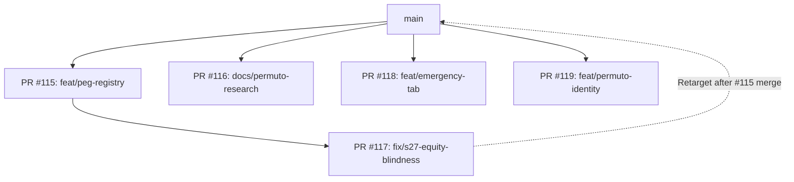

# Comprehensive Code Review: Open Pull Requests (#115, #116, #117, #118, #119)

**Review Date:** 2026-08-27  
**Reviewer:** GitHub Copilot (Gemini 3.7 Flash)  
**Repository:** `Bella-Addormentata/XOPTrader`  
**Review Target:** All 5 Open Pull Requests across C++ Core, Python GUI Services, Documentation, and Research Tools  

---

## Table of Contents

1. [Executive Summary & PR Dependency Graph](#1-executive-summary--pr-dependency-graph)
2. [Review of PR #115: `feat/peg-registry`](#2-review-of-pr-115-featpeg-registry)
3. [Review of PR #116: `docs/permuto-research`](#3-review-of-pr-116-docspermuto-research)
4. [Review of PR #117: `fix/s27-equity-blindness`](#4-review-of-pr-117-fixs27-equity-blindness)
5. [Review of PR #118: `feat/emergency-tab`](#5-review-of-pr-118-featemergency-tab)
6. [Review of PR #119: `feat/permuto-identity`](#6-review-of-pr-119-featpermuto-identity)
7. [Recommended Merge Sequence & Action Plan](#7-recommended-merge-sequence--action-plan)

---

## 1. Executive Summary & PR Dependency Graph

As of 2026-08-27, there are **five open pull requests** in the repository representing major architectural enhancements, incident fixes, and competition infrastructure:

| PR # | Branch | Base | Scope | Key Focus |
|---|---|---|---|---|
| **#115** | `feat/peg-registry` | `main` | C++ Core & Config | Asset-level `PegRegistry`, retirement of hardcoded `$1.00` literals, currency-aware par valuation. |
| **#116** | `docs/permuto-research` | `main` | Documentation & Scripts | Permuto competition scope (`TODO-COMPETITION.md`), API routes, SVPerp empirical research, and depth probes. |
| **#117** | `fix/s27-equity-blindness` | `feat/peg-registry` | C++ Core & Risk | S27/S32/S33 fixes: CoinGecko feed-first with DEX fallback, unpriced asset write-offs, fail-closed valuation guards. |
| **#118** | `feat/emergency-tab` | `main` | Python GUI Service | Pure consolidation planning logic for emergency book sweeps into a target asset with slippage caps. |
| **#119** | `feat/permuto-identity` | `main` | Python GUI & UI | Local BLS trading identity, 24-word BIP-39 derivation, AugSchemeMPL link/auth flow, and Qt tab. |



---

## 2. Review of PR #115: `feat/peg-registry`

**Branch:** `feat/peg-registry` $\rightarrow$ `main`  
**Commits:** 24 commits | **Files Changed:** 10 (+1,346 lines, -62 lines)

### 2.1 Strengths & Architectural Improvements
1. **Asset-Centric Peg Identity:** Replaces fragile ticker substring matches (`quote == "wUSDC.b" || ...`) spread across 15 sites with a centralized, immutable-identity `PegRegistry` keyed on canonical asset IDs (CAT tail hashes or `"xch"`).
2. **Currency & FX Decoupling:** Peg definitions explicitly require `peg_currency` (e.g., USD, EUR, JPY) and `peg_target`. Non-USD assets without an FX conversion yield `std::nullopt` rather than a silent 1:1 dollar substitution.
3. **Fail-Loud Parser:** `cpp/src/config.cpp` enforces strict structural validation:
   - Lowercases asset IDs to prevent casing mismatches from CLI outputs.
   - Throws `ConfigError` on duplicate `asset_id` entries.
   - Throws on invalid thresholds (`warn_pct == 0.0`, `bail_pct <= warn_pct`, non-finite values).
   - Rejects non-sequence YAML nodes to catch indentation errors.
4. **Clean Unified Cross Valuation:** Commit `54b2caf` unified direct (`<target>/<wrapper>`) and inverse (`<wrapper>/<target>`) pair orientations into `Engine::market_cross_for`, eliminating duplicate pricing loops.

### 2.2 Remaining Findings & Potential Improvements

#### Finding 2.2.1 [Low / Informational]: Cross-Pair Spread Gate on Zero Spread
In `Engine::market_cross_for` (`cpp/src/engine.cpp:11412`):
```cpp
auto snap = state_->get_market(other.name);
if (!(snap.mid_price > 0) || !(snap.spread_bps > 0.0)
    || snap.spread_bps > kMaxCrossSpreadBps) {
    continue;
}
```
- **Context:** On Dexie, crossed books (where best bid $\ge$ best ask) or one-sided books often report `spread_bps <= 0.0`.
- **Behavior:** The condition `!(snap.spread_bps > 0.0)` intentionally skips crossed or one-sided books and falls back to `declared_usd_par`. This matches the documented policy ("spread_bps is 0 for one-sided or crossed books, which also (correctly) selects par"), but ensure operators understand that crossed market books will not override declared par.

#### Finding 2.2.2 [Low / Operational]: Example Config Coverage
In `config.example.yaml`:
- The sample declares `wUSDC.b` and `BYC`.
- Legacy pairs that may trade `wUSDC` or `USDS` will receive `$0.00` valuation unless explicitly added to `pegged_assets` in `config.yaml`.
- **Recommendation:** Keep commented reference blocks for `wUSDC` and `USDS` in `config.example.yaml` with their known CAT tail hashes so operators migrating older setups have immediate copy-paste references.

---

## 3. Review of PR #116: `docs/permuto-research`

**Branch:** `docs/permuto-research` $\rightarrow$ `main`  
**Commits:** 13 commits | **Files Changed:** 5 (+1,918 lines, 0 lines deleted)

### 3.1 Strengths & Scope
1. **Clean Separation of Concerns:** Splits extensive venue research and empirical data out of PR #115 into standalone, dedicated files.
2. **Exemplary Research Integrity:** Explicitly catalogs self-corrections (e.g., leaderboard pagination factor of 35x, non-monotonic score drops, oracle cash-session freeze).
3. **Rigorous Literature Grounding:** Differentiates verified academic literature from unverified web citations in `docs/advanced-trading-methods.md` §4.

### 3.2 Findings & Code Suggestions

#### Finding 3.2.1 [Low / Robustness]: JSON Parse Error Handling in `scripts/permuto_depth_analyze.py`
In `scripts/permuto_depth_analyze.py:36`:
```python
def load(path):
    header, rows = None, []
    with open(path, encoding="utf-8") as fh:
        for line in fh:
            line = line.strip()
            if not line:
                continue
            d = json.loads(line)
            if "probe_start" in d:
                header = d
            else:
                rows.append(d)
    return header, rows
```
If `scripts/permuto_depth_probe.py` is killed mid-write or a file flush is incomplete, a malformed JSON line will abort the analyzer.

**Suggested Change:**
```diff
--- a/scripts/permuto_depth_analyze.py
+++ b/scripts/permuto_depth_analyze.py
@@ -33,7 +33,11 @@ def load(path):
             line = line.strip()
             if not line:
                 continue
-            d = json.loads(line)
+            try:
+                d = json.loads(line)
+            except json.JSONDecodeError:
+                print("warning: skipping malformed JSON line in %s" % path, file=sys.stderr)
+                continue
             if "probe_start" in d:
                 header = d
             else:
```

---

## 4. Review of PR #117: `fix/s27-equity-blindness`

**Branch:** `fix/s27-equity-blindness` $\rightarrow$ `feat/peg-registry`  
**Commits:** 11 commits | **Files Changed:** 7 (+1,460 lines, -14 lines)

### 4.1 Strengths & Root-Cause Resolution
1. **External Price Feed Prioritization:** In `usd_per_xch()`, CoinGecko XCH/USD price is queried first with a strict freshness check against `coingecko_last_fetch_` and `cex_freshness_threshold_sec`. If CoinGecko is stale or down, it seamlessly falls back to on-chain DEX mid prices.
2. **Fail-Closed Breaker Protection:** Eliminates the inert breaker condition where uninitialized high-water marks (`peak_equity_hwm_usd_ == 0.0`) prevented drawdown detection. If an unvaluable book persists past startup grace, `risk::unvaluable_book_must_fail_closed` transitions the engine to `BotStatus::Paused`.
3. **Structural Write-Offs (S32):** Held assets that have no enabled trading pairs (`!asset_has_pricing_path`) are valued at `$0.00` without permanently degrading the cycle, preventing indefinite engine startup pauses when holding inactive assets (e.g., deprecated wrapped tokens).
4. **Bridging Protection (S33):** Introduces `any_fresh_carry_bridging` to ensure transient single-tick pricing gaps on one asset do not latch the fail-closed breaker when other assets have valid carry entries within their TTL.
5. **Formal Mathematical Proofs in Tests:** Adds comprehensive test fixtures in `cpp/tests/test_drawdown_breaker.cpp` verifying mathematical invariant boundaries.

### 4.2 Verified Implementation Details
- `Engine::usd_per_xch()` correctly uses `coingecko_feed_fresh_for_revival` to enforce feed freshness before consuming cached external prices.
- Unsigned block arithmetic is safely guarded against height regressions.
- Step 13 logs rate-limited warnings for unpriceable and never-valued assets.

---

## 5. Review of PR #118: `feat/emergency-tab`

**Branch:** `feat/emergency-tab` $\rightarrow$ `main`  
**Commits:** 4 commits | **Files Changed:** 6 (+1,000 lines, -1 line)

### 5.1 Strengths & Architecture
1. **Decoupled Pure Planning Engine:** The consolidation planner in `gui/services/consolidate/planner.py` is 100% pure functional logic, completely decoupled from Qt, networking, and wallet RPCs.
2. **Cross-Denomination Precision:** Correctly accounts for XCH ($10^{12}$ mojos) versus CAT ($10^3$ mojos) unit scaling across all rate calculations and slippage comparisons.
3. **Best-Price-First Safety:** Offers are sorted by `effective_rate` ascending (lowest give-per-receive first). The slippage cap acts strictly as a stop condition, ensuring that widening the slippage cap cannot displace high-quality fills.
4. **Float Boundary Epsilon:** Implements `_CAP_EPSILON = 1e-9` relative tolerance in `within_cap` to eliminate IEEE-754 binary floating-point boundary rejections.
5. **Two-Hop Residual Accounting:** Accurately tracks intermediate asset residuals in `ConsolidationPlan.hop_residual` when second-leg market depth cannot absorb the full yield of the first leg.

### 5.2 Identified Issues & Code Suggestions

#### Finding 5.2.1 [Low / Defensive]: Validate Hop Asset Uniqueness in `build_plan`
In `gui/services/consolidate/planner.py:382`:
`build_plan` validates `source_asset != target_asset`, but does not explicitly guard against `hop_asset == source_asset` or `hop_asset == target_asset`. If a caller accidentally passes `hop_asset == source_asset`, `_plan_leg` attempts to plan a hop trading the asset for itself and yields an empty plan rather than failing fast.

**Suggested Change:**
```diff
--- a/gui/services/consolidate/planner.py
+++ b/gui/services/consolidate/planner.py
@@ -382,6 +382,8 @@ def build_plan(
     if source_asset == target_asset:
         raise PlanError("source and target are the same asset")
     if budget <= 0:
         raise PlanError(f"budget must be positive, got {budget}")
+    if hop_asset is not None and hop_asset in (source_asset, target_asset):
+        raise PlanError(f"hop asset {hop_asset!r} cannot match source or target asset")
     if max_slippage_frac != max_slippage_frac or max_slippage_frac in (
```

#### Finding 5.2.2 [Low / Documentation]: Clarify Taker Perspective in `OfferCandidate`
In Dexie API responses, `offered` is what the maker gives, and `requested` is what the maker receives.
In `OfferCandidate`, `give_asset`/`give_amount` is what the **taker (XOPTrader)** gives, and `receive_asset`/`receive_amount` is what the taker receives.
- **Recommendation:** Add an explicit comment in `OfferCandidate` docstring highlighting this mapping convention for future engineers implementing the GUI/Wallet execution adapter.

---

## 6. Review of PR #119: `feat/permuto-identity`

**Branch:** `feat/permuto-identity` $\rightarrow$ `main`  
**Commits:** 5 commits | **Files Changed:** 12 (+1,950 lines, -7 lines)

### 6.1 Strengths & Security Posture
1. **Deterministic Chia Derivation:** Generates BLS master secret keys directly from standard 24-word BIP-39 recovery phrases (`BIP-39 PBKDF2 -> 64-byte seed -> AugSchemeMPL.key_gen`). This ensures full recovery compatibility in standard Chia wallets (Sage, Chia reference client).
2. **At-Rest Protection:** Private keys are stored in `secrets.yaml` wrapped with DPAPI (Windows) or platform secret protectors with dedicated domain-separation entropy (`_IDENTITY_ENTROPY = b"xop.permuto.identity.v1"`).
3. **Transient Plaintext Mnemonic:** The 24-word recovery phrase is returned once in memory during generation and is never written to disk or serialised.
4. **Clipboard Security:** `_RecoveryPhraseDialog` records the SHA-256 hash of the copied phrase and wipes the clipboard upon dialog exit if the clipboard still contains the matching text.
5. **Thread Safety & Lifecycle:** `MainWindow.closeEvent` calls `PermutoWidget.stop_background_work()` to join or terminate active network worker threads, preventing Qt `qFatal` aborts on app shutdown.

### 6.2 Critical Bugs & Code Suggestions

#### Finding 6.2.1 [CRITICAL]: Potential `TypeError` on JSON `null` in `leaderboard_entry`
In `gui/services/permuto/auth.py:123-125`:
```python
total = max(
    page.get("market_makers_total", 0), page.get("traders_total", 0)
)
```
- **The Bug:** If the Permuto API returns `{"market_makers_total": null, "traders_total": 50}` (valid JSON `null`, which parses as Python `None`), `page.get("market_makers_total", 0)` returns `None` because the dictionary key exists.
- In Python 3, evaluating `max(None, 50)` raises:
  `TypeError: '>' not supported between instances of 'int' and 'NoneType'`
- This will crash the leaderboard lookup worker and show a "Failed" status in the UI.

**Suggested Fix in `gui/services/permuto/auth.py`:**
```diff
--- a/gui/services/permuto/auth.py
+++ b/gui/services/permuto/auth.py
@@ -121,8 +121,8 @@ def leaderboard_entry(user_id: str) -> Optional[dict]:
             len(page.get("market_makers", [])), len(page.get("traders", []))
         )
         total = max(
-            page.get("market_makers_total", 0), page.get("traders_total", 0)
+            page.get("market_makers_total") or 0, page.get("traders_total") or 0
         )
         if seen >= total:
             return None
```

#### Finding 6.2.2 [Low / Defensive]: Clean String Formatting on Incomplete Credentials
In `gui/services/permuto/auth.py:220`:
```python
if not user_id or not trading_address:
    raise PermutoAuthError(
        "link succeeded but the venue did not return both identifiers "
        "(user_id=%r, address=%r); refusing to record a registration we "
        "cannot verify" % (user_id, trading_address)
    )
```
- This validation is clean and properly guards against blank strings.

---

## 7. Recommended Merge Sequence & Action Plan

To ensure a seamless, conflict-free integration into `main`, execute the merge in the following structured sequence:

### Phase 1: Merge Core Peg Valuation Foundation
1. **PR #115 (`feat/peg-registry`):**
   - Verify all unit tests pass: `ctest --test-dir cpp/build -C Release`.
   - Merge PR #115 into `main`.

### Phase 2: Retarget & Merge Incident Fixes
2. **PR #117 (`fix/s27-equity-blindness`):**
   - Retarget base branch to `main`.
   - Verify build and tests on `main`.
   - Merge PR #117 into `main`.

### Phase 3: Merge Research Documentation & Scripts
3. **PR #116 (`docs/permuto-research`):**
   - Apply JSON decode error guard in `scripts/permuto_depth_analyze.py`.
   - Merge PR #116 into `main`.

### Phase 4: Merge New GUI Features
4. **PR #118 (`feat/emergency-tab`):**
   - Add hop asset uniqueness check in `build_plan`.
   - Run `pytest gui/services/consolidate/tests`.
   - Merge PR #118 into `main`.

5. **PR #119 (`feat/permuto-identity`):**
   - Apply the `page.get(...) or 0` fix in `gui/services/permuto/auth.py`.
   - Run `pytest gui/services/permuto/tests`.
   - Merge PR #119 into `main`.

---
*Comprehensive Review generated by GitHub Copilot (Gemini 3.7 Flash) for XOPTrader.*
