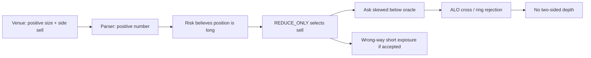

# Permuto Depth Qualification Recovery Plan

**Date:** 2026-08-31  
**Evidence cutoff:** 2026-08-31 17:51 UTC  
**Scope:** live Permuto market-maker behavior, scoring, quote targets, inventory risk, and the fastest defensible route to prize eligibility

## Executive conclusion

The account's problem is not primarily insufficient configured quote size. It is that almost none of the configured size is resting as qualifying, two-sided liquidity.

During the final live sampling window:

- public leaderboard PnL was **+$205,285.08** with **$705,285.08 equity**, then **+$181,601.04** with **$681,601.04 equity** only minutes later;
- the in-process watcher printed **+$225,752.28** between those reads, showing how much of the lead is mark-sensitive and how publication timing can differ;
- reported depth was still exactly **4,093.892 depth-seconds**;
- the account had three large **short** positions;
- the runner was emitting three one-sided `sell` legs and receiving persistent post-only and oracle-band rejections;
- the log contained 49 unchanged `depth 4094` samples, 292 HTTP-400 tick failures, 563 `batch_failed` responses, and 90 earlier depth-stall warnings.

The most important defect is a position-sign parsing error. Permuto returns list-form positions as a positive `size` plus `side: "sell"`. `_margin_state()` copies the positive size and ignores `side`, so the risk layer interprets a short as a long. It then chooses `sell` as the supposedly shrinking side and skews that ask below the oracle. This is the wrong direction for the actual inventory and is exactly the shape the venue rejects as an aggressive/post-only ask.

**Do not increase target size while this defect is live.** A jump from $1,200 to $25,000 per market would amplify a wrong-way order path by 20.8 times and expose the current PnL lead to a rapid reversal.

The recommended order of operations is:

1. retract the live Permuto book;
2. fix and test position sign normalization;
3. make ALO placement aware of the live BBO;
4. verify two-sided resting orders and positive measured depth accrual at the existing $1,200 target;
5. ramp only to $1,500-$3,000 per market, based on measured uptime and inventory growth;
6. keep the overnight short curfew until the active-session path is proven.

At $2,000 per market across three markets, only **13.89 hours of actual qualifying uptime** are needed to bank the remaining 299,995,906 depth-seconds. About 28.2 active cash-session hours remained at the cutoff. There is no need to risk $25,000 per market to qualify.

## 1. What the contest actually requires

The operative gate is **300,000,000 depth-seconds**, not 300,000. The live `/info/meta` response confirms `mm_prize_min_depth_seconds: 300000000`.

Per scoring interval and per market:

$$
D_m = \min(B_m, A_m)
$$

where $B_m$ and $A_m$ are resting bid and ask notional within the qualifying oracle ring. Total accumulation is:

$$
\Delta S = \Delta t \sum_m D_m
$$

Consequences:

- a one-sided market contributes zero;
- a rejected or purged leg contributes zero;
- excess size on only one side contributes nothing beyond the smaller side;
- downtime, pauses, stale-oracle periods, and repair gaps contribute zero;
- depth is an eligibility gate only; eligible accounts are ranked by net PnL.

The venue currently reports:

- legal placement band: +/-5%;
- qualifying/aggressive ring: +/-2%;
- three active markets: `QQQ-VOL-PERP`, `NVDA-VOL-PERP`, and `TSLA-VOL-PERP`;
- lot size 1 and tick size 0.0001;
- 10x maximum leverage;
- $6,000 impact notional.

## 2. Live snapshot

### 2.1 Public standing

The local registered identity matched leaderboard prefix `b3edfaa8` in the 17:47 UTC snapshot:

| Metric | Value |
| --- | ---: |
| Net PnL | +$205,285.08 |
| Equity | $705,285.08 |
| Balance | $616,558.58 |
| Realized PnL | +$114,975.79 |
| Unrealized PnL | +$88,726.50 |
| Depth, 5d | 4,093.892 |
| Depth, 24h | 4,093.892 |
| Reported trade count | 200 |
| Prize eligible | false |

A final public read at 17:51 UTC showed **+$181,601.04 PnL**, **$681,601.04 equity**, and the same **4,093.892 depth**. The depth conclusion is stable; the PnL snapshot is not.

The component PnL figures do not sum exactly to total PnL; funding, fees, or another venue ledger component accounts for the difference. The report therefore treats `total_pnl` and `equity` as authoritative rather than reconstructing them.

The leaderboard's `trade_count` remained at 200 while logged position snapshots continued to change. Treat it as **at least 200** or a display/API cap, not proof that activity stopped at exactly 200 fills.

### 2.2 Position evidence

The latest full batch response in `logs/gui.log` reported:

| Market | Venue side | Contracts | Entry price | Logged margin |
| --- | --- | ---: | ---: | ---: |
| QQQ-VOL-PERP | sell | 812,520 | 0.0445631 | $3,620.84 |
| NVDA-VOL-PERP | sell | 813,647 | 0.0637568 | $5,187.56 |
| TSLA-VOL-PERP | sell | 825,541 | 0.1782914 | $14,718.68 |

All three positions are short. At one nearby oracle snapshot they represented roughly $166,000 of aggregate mark notional, dominated by TSLA. That estimate moves quickly with the oracle and is included only to show scale.

The account is not close to the code's 50% margin-utilization stop, but that is not the relevant comfort test. The PnL lead is substantially unrealized and the oracle is a noisy 60-second realized-volatility estimate that can jump sharply at the equity open. Observed values moved from approximately +$205k to an in-process +$226k and then to a public +$182k within minutes. Whatever portion is publication lag, the account is not holding a stable $200k banked gain.

### 2.3 Runtime chronology

- The contest opened at 13:30 UTC.
- The first unchanged `depth 4094` watcher sample in the retained log was at 13:53 UTC.
- Reported trades rose from 134 to 200 by 14:07 UTC.
- Depth remained 4,093.892 through at least 17:47 UTC.
- During that interval the loop repeatedly attempted batches, but most legs were rejected as either:
  - `Post-only order would cross the book`;
  - `Aggressive ask ... outside the +/-2% ring`;
  - `Price ... outside the allowed oracle band`.

This is not a low accrual rate. It is a near-total qualification outage while directional PnL continues to move.

## 3. Current implementation and effective settings

### 3.1 Hardcoded controls

The live GUI page sets:

- `target_depth_usd = 1_200.0` per market per side;
- `max_position_usd = 1_200.0` per market;
- all three markets enabled together;
- one level per side;
- 0.25% initial half-spread;
- 2% ring;
- 5-second polling;
- overnight curfew enabled by default.

The widget passes its explicit values to `PermutoLive`, so changing only the defaults in `QuoteRunner` or `PermutoLive` does **not** alter the production path. The values must be wired to configuration or changed at the widget-owned source.

### 3.2 Price construction

For an unskewed market:

$$
p_{bid} = O(1-0.0025), \qquad p_{ask} = O(1+0.0025)
$$

The risk layer shifts both prices with inventory. At a saturated positive position, the current skew ceiling is -0.96%. The resulting ask is approximately:

$$
O(1-0.0096)(1+0.0025) \approx 0.9929O
$$

That is an **ask below the oracle**. It is aggressive and can cross a resting bid, which explains the observed ALO rejection. The price behavior is internally consistent with what the risk layer believes; the belief about position direction is wrong.

### 3.3 Position-limit geometry

The target and limit are both $1,200. One nearly complete quote fill can therefore move a flat market directly to its position limit. At the limit, the runner cancels both sides and retains only a reduce-only leg. That guarantees zero depth for that market even when the reduction order rests successfully.

The ratio between quote target and inventory limit is therefore structurally unsuitable for continuous two-sided scoring. A position cap should be several quote fills away, not equal to one quote leg.

### 3.4 Carried-session behavior is internally inconsistent

`risk.assess()` divides size by eight only when `state.carried` is true. `_default_venue_state()` infers `carried` from market status not being `active`. However, the project's own live observation found all markets still reported `active` while their oracles were frozen overnight.

Therefore the 1/8 carried-size reduction may not activate in the very overnight state it is meant to protect. The curfew currently masks that defect by prohibiting new short exposure, which also makes the book one-sided and earns zero depth.

Changing only `OVERNIGHT_SHORT_FRACTION` from zero would remove that protection and can expose the **full live target**, not the assumed divided-by-eight target, during the dangerous frozen-oracle window.

## 4. Root causes, ordered by urgency

### P0: Short positions are parsed as positive longs

In list-form account payloads, `_margin_state()` currently does:

```python
positions[market] = float(row.get("size", row.get("position", 0.0)))
```

It does not inspect `row["side"]`. Live responses contain positive size plus `side: "sell"`. Downstream code defines positive as long and negative as short.

The resulting chain is:



This is both a depth failure and a PnL risk. Raising the cap does not fix it; it only delays the point at which the wrong interpretation enters reduce-only mode.

Required correction:

- normalize list-form positions to signed contracts;
- `buy`/`long` must become `+abs(size)`;
- `sell`/`short` must become `-abs(size)`;
- unknown side values must fail closed rather than default positive;
- add tests using the exact live payload shape;
- verify the resulting intended reduction leg against a captured account response before restarting.

The existing parser test uses a list row with `size` but no `side`, so it confirms only numeric extraction and cannot detect this defect. A direct reproduction with the live shape `{side: "sell", size: "812520"}` returned `+812520.0`; the required signed result is `-812520.0`.

### P0: ALO prices are not BBO-aware

The bot prices only from oracle and inventory. It does not read best bid/ask before sending. A legal in-ring price can still cross the current book and be rejected by `tif=alo`.

The log shows this is persistent, not hypothetical. Switching every rejected leg to GTC is not an acceptable generic fix: a crossing GTC order becomes a taker order, adds inventory/slippage, and does not rest to earn depth.

A 17:51 UTC public L2 sample showed 10-15 bid levels but only one ask level in each market. That is consistent with the earlier observer's finding that qualifying asks are scarce and are the side most likely to be lifted. It also means an oracle-only ask can easily cross a bid even while remaining legal relative to the oracle.

Required correction:

- ingest current BBO with the oracle;
- clamp a buy below best ask by at least one tick;
- clamp a sell above best bid by at least one tick;
- retain an explicit buffer inside the +/-2% ring;
- if no post-only price exists inside the ring, skip that market for the tick and allocate depth elsewhere;
- reconcile the actual resting side on the next tick.

### P0: The live strategy is in permanent one-sided recovery

Because every parsed position is far beyond the $1,200 cap, all markets are in `REDUCE_ONLY`. By design, reduce-only mode emits one side and earns zero depth. The current loop therefore cannot qualify no matter how long it runs.

This should be visible as a first-class operator state. A toolbar status that merely says the loop is running is insufficient; the GUI must show per market:

- signed position and mark notional;
- intended and actual resting side(s);
- in-ring bid and ask notional;
- balanced qualifying notional;
- measured leaderboard slope;
- reason for any zero-depth state.

### P1: Rejection handling creates long blind periods

After five rejected batches, the breaker probes only once per minute. That behavior is sensible for an unknown systematic rejection, but it makes a deterministic, repairable ALO conflict expensive in contest time. The correct fix is not a smaller breaker interval; it is to change the price after learning the rejection and keep unaffected markets quoting.

The current response-to-request association is also weak because result rows often omit market and side. Preserve the outgoing leg order and correlate each response row by index so logs can name the exact intended market, side, price, size, and rejection.

### P1: All markets share one target and one risk limit

Depth is additive across markets, but risk is not homogeneous. TSLA has the largest current short notional and the earlier observer characterized it as the most trend-prone of the three. A single global target forces the highest-risk market to receive the same size as the safer candidate markets.

Add per-market controls:

- enable/disable;
- active target depth;
- carried target depth;
- maximum position notional;
- half-spread;
- maximum inventory skew;
- optional daily fill/loss budget.

### P1: Polling and preflight still lose the oracle race

The pre-send re-fetch reduced one class of stale pricing, but the log still contains hundreds of band/ring HTTP 400s. Sequential HTTP reads and sends cannot guarantee that a fast-moving 5-second oracle remains inside the host's view.

The robust path is the venue WebSocket for oracle/BBO updates, plus a send-time guard that drops only the affected leg. Until then, wider passive offsets and BBO-aware clamping are more valuable than higher size.

## 5. Qualification arithmetic from the cutoff

At 17:47 UTC:

$$
S_{remaining} = 300{,}000{,}000 - 4{,}093.892 = 299{,}995{,}906.108
$$

There were approximately 353,540 wall-clock seconds left, so the theoretical minimum continuous aggregate balanced depth was:

$$
\bar D = \frac{299{,}995{,}906.108}{353{,}540} \approx \$848.55
$$

That minimum has no outage or rejection allowance and is not an operating target.

### 5.1 Qualifying uptime required

These figures assume all named markets actually have both sides resting in-ring:

| Target per market | Markets | Aggregate balanced depth | Qualifying time to gate |
| ---: | ---: | ---: | ---: |
| $1,200 | 3 | $3,600 | 23.15 h |
| $1,500 | 3 | $4,500 | 18.52 h |
| $2,000 | 3 | $6,000 | 13.89 h |
| $3,000 | 3 | $9,000 | 9.26 h |
| $5,000 | 3 | $15,000 | 5.56 h |
| $25,000 | 3 | $75,000 | 1.11 h |

Approximately 28.2 cash-session hours remained. Even the current $1,200 target can mathematically qualify during cash sessions alone if it achieves roughly 82% two-sided uptime. A $2,000 target needs about 49% of those remaining cash-session hours.

This is why quote correctness and uptime dominate size. Moving from effectively 0% qualifying uptime to 50% is infinitely more valuable than multiplying rejected orders by twenty.

### 5.2 Recommended target ramp

Use measured gates rather than a single large jump:

| Stage | Per-market target | Promotion condition | Maximum duration |
| --- | ---: | --- | ---: |
| Repair proof | $1,200 | all enabled markets two-sided; slope >=3,200/s; no wrong-way leg | 15 min |
| Qualification base | $2,000 | slope >=5,400/s; no net position growth beyond budget | 60 min |
| Catch-up | $3,000 | projected gate ETA misses Wednesday; margin and mark PnL stable | 60 min review cycle |
| Emergency only | $5,000 | verified BBO-aware path; explicit operator approval | shortest necessary |

Do not use $25,000 per market on the current code path. The gate does not require it, and the observed fill intensity makes the position consequence disproportionate.

## 6. PnL-preserving market allocation

The best score after eligibility is still PnL, so the objective is:

$$
\min \text{risk taken} \quad \text{subject to} \quad S(T) \ge 300{,}000{,}000
$$

Recommended allocation policy after the P0 fixes:

1. Start at the existing $1,200 on all markets only long enough to prove the plumbing.
2. Prefer QQQ and NVDA for incremental depth; cap TSLA lower until its current short is reduced and its realized fill quality is measured.
3. Use wider passive quotes, approximately 1.0%-1.25% half-spread, with a separate skew cap that leaves at least 0.2%-0.3% inside the 2% ring.
4. Keep both sides equal in qualifying notional. Extra notional on one side earns no additional credit.
5. Recompute gate ETA from the **measured leaderboard slope**, not submitted size.
6. Once the gate is banked, reduce target depth sharply or stop, depending on the rules snapshot and desired PnL defense.

An initial post-repair configuration worth testing, not blindly deploying, is:

| Market | Active target/side | Half-spread | Position policy |
| --- | ---: | ---: | --- |
| QQQ-VOL-PERP | $2,000 | 1.0%-1.25% | explicit signed-notional cap |
| NVDA-VOL-PERP | $2,000 | 1.0%-1.25% | explicit signed-notional cap |
| TSLA-VOL-PERP | $1,200 or disabled | 1.25%-1.5% | do not grow current short until reviewed |

With QQQ and NVDA alone at $2,000 each, the gate needs 20.83 qualifying hours. Adding TSLA at $1,200 reduces that to about 16.03 hours, but only if its additional fill risk is acceptable.

## 7. Overnight decision

The current overnight curfew intentionally prohibits new shorts. That makes the book one-sided and earns zero depth, but it protects against the documented frozen-oracle/opening-gap attack.

Do not relax it as the first response to low depth because:

- enough active-session time remains;
- the account is already short all three markets;
- the carried-state detector may not apply the expected 1/8 size reduction;
- current order direction is wrong;
- the opening print is the most dangerous observed regime;
- accumulated active-session depth is sufficient at modest targets once uptime works.

If active-session accrual is still behind plan on Wednesday, implement an explicit carried mode rather than changing one constant:

- carried state derived from schedule or confirmed oracle freeze;
- separate small target, not an implicit divisor;
- two-sided quoting only when current signed positions leave room on both sides;
- mandatory BBO-aware passive placement;
- no TSLA overnight until its short is below its dedicated cap;
- forced book withdrawal before the opening transition;
- measured depth slope and position delta reviewed every 15 minutes.

## 8. Implementation plan

### Patch A: position semantics and tests

Files:

- `gui/services/permuto/runner.py`
- `gui/services/permuto/tests/test_runner.py`

Acceptance criteria:

- a live-shaped `{market, side: "sell", size: "812520"}` row becomes `-812520`;
- `side: "buy"` becomes positive;
- a short at its cap emits only a `buy` reduction leg;
- a long at its cap emits only a `sell` reduction leg;
- unknown/malformed side with nonzero size causes fail-closed behavior;
- all existing Permuto tests pass.

### Patch B: BBO-aware ALO placement

Files likely involved:

- `gui/services/permuto/live.py`
- `gui/services/permuto/orders.py`
- `gui/services/permuto/runner.py`
- corresponding tests

Acceptance criteria:

- every submitted buy is below current best ask by a tick;
- every submitted sell is above current best bid by a tick;
- every scoring leg remains strictly inside the 2% ring with buffer;
- an infeasible market is skipped without blocking healthy siblings;
- no automatic GTC fallback silently takes liquidity.

### Patch C: real configuration

Replace widget-only constants with validated settings for:

- enabled markets;
- active and carried target depth by market;
- max position notional by market;
- active and carried half-spread;
- inventory skew ceiling;
- curfew policy.

Changing `QuoteRunner` defaults alone is not sufficient because `PermutoWidget` explicitly passes its own values through `MainWindow`.

### Patch D: outcome telemetry

Add a 1-minute operational line with:

- raw depth total and delta/second;
- projected UTC qualification time;
- actual bid and ask notional in-ring per market;
- signed position notional per market;
- accepted/rejected legs by market and side;
- realized, unrealized, funding/fees, and total PnL when available.

Alert immediately when:

- depth slope is below 80% of submitted aggregate target for two samples;
- any enabled market is one-sided for more than 15 seconds;
- an intended reduce-only leg points in the same direction as the venue position;
- mark PnL falls by a configured amount from its high-water mark;
- projected gate ETA crosses Friday 18:00 UTC, leaving a two-hour repair buffer.

## 9. Operator runbook

### Immediate safety and repair

1. Turn the Permuto venue off and confirm `cancel_all` succeeded.
2. Record a fresh authenticated account and open-orders snapshot.
3. Fix position sign parsing and add the live-shape tests.
4. Add or verify BBO-aware ALO placement.
5. Rebuild/restart the GUI and confirm it displays all three positions as short.
6. Confirm a short position produces a buy-side reduction instruction.

### Controlled restart

1. Start at $1,200 per enabled market.
2. Confirm two actual resting sides per market through `/exchange/open_orders`.
3. Wait for two leaderboard samples and require a depth slope near the expected aggregate target.
4. If slope is healthy and signed inventory is not growing outside budget, increase to $2,000 per market.
5. Recalculate ETA every five minutes.
6. Do not promote size while HTTP 400, `batch_failed`, or one-sided rates remain elevated.

### Qualification lock-in

1. Confirm raw depth exceeds 300,000,000 and `prize_eligible` is true.
2. Capture the leaderboard response and timestamp.
3. Reduce or stop quoting according to the final rules and PnL-defense decision.
4. Continue monitoring because displayed 5-day fields and contest-banked fields must not be assumed identical without the eligibility boolean.

## 10. Evidence limits

- The public leaderboard and local runtime log were inspected directly.
- An authenticated trade-history export was not initiated during this review because minting a second session while the live GUI was trading could disturb the active session. The retained log and leaderboard establish at least 200 reported trades, large changing positions, and the exact rejection modes, but they do not provide a clean fill-by-fill realized-edge study.
- Current oracle notionals and unrealized PnL move rapidly. All account values in this report are timestamped observations, not stable balances.
- The code-review draft named `CODEREVIEW-20260831-Permuto-Market-Maker-Depth-Seconds-and-PnL-Optimization-Analysis.md` was present concurrently. Its recommendation to move directly to $25,000 per market and relax the overnight short curfew is superseded by this report because it did not account for the live position-sign defect or the carried-state inconsistency.

## Final recommendation

The fastest credible route to 300M is **not** a drastic size increase. It is restoring valid two-sided uptime, then using a modest target with a measured ETA.

Fix the position sign and ALO placement first. Prove approximately $3,600/s at the existing target, then move to $6,000-$9,000/s aggregate only if needed. That clears the gate in roughly 9-14 qualifying hours while preserving far more of the current PnL lead than a $75,000 aggregate sprint through a demonstrably wrong-way order path.