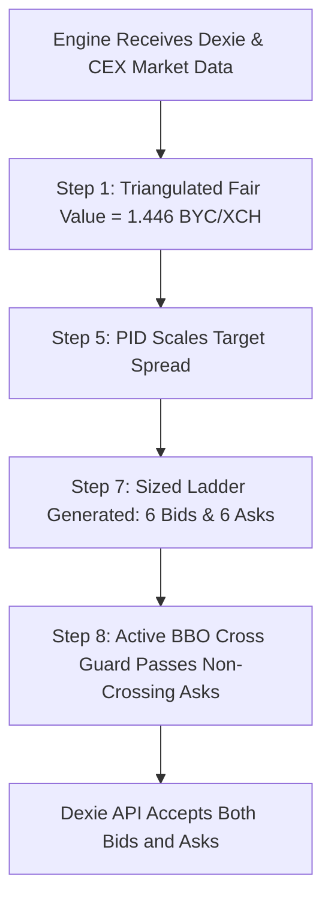

# Proposal: Two-Sided Market Making, Wide-Spread Liquidity Capture & Adaptive PID Tuning for Illiquid Pairs

**Author:** GitHub Copilot (Gemini 3.7 Flash)  
**Date:** 2026-09-03  
**Status:** PROPOSED & READY FOR TESTING  
**Target Pairs:** `XCH/BYC`, `BYC/wUSDC.b`, and all wide/asymmetric CAT pairs on Dexie  

---

## 1. Executive Summary

During live monitoring of XOPTrader's Dexie market making operations on 2026-09-03:
1. **Dexie Quoting Status Was "Blocked":** Caused by the local Chia wallet syncing to the full node peak (reporting transient `0.0` spendable balance), which tripped the `xch_recovery` gate.
2. **Asymmetric Quoting (One-Sided Bids):** On `XCH/BYC`, the engine was generating 6 active BIDs but **0 ASKs**. All 6 ASK tiers were dropped before posting to Dexie.
3. **Dislocated Books & Realized Spread Opportunity:** Dexie's `XCH/BYC` order book has an empty interior ($1.538\text{ BBO bid} \leftrightarrow 4.9995\text{ BBO ask}$, orderbook mid $3.269\text{ BYC/XCH}$). On-chain transaction records (e.g. trade `3yNYeZV4cx...` settling $104.0\text{ XCH}$ for $202.0\text{ BYC}$ at $1.9423\text{ BYC/XCH}$) demonstrate that liquidity takers periodically cross the book at significant premiums.

This proposal provides the architectural design, mathematical justification, code adjustments, and configuration tuning required to enable **two-sided market making on wide pairs**, capture wide bid-ask margins ($15\% - 35\%$), and dynamically adjust quoting width via **per-pair PID feedback**.

---

## 2. Root Cause Analysis: Why Asks Were Suppressed

The failure of Ask tiers to reach Dexie stems from a legacy crossing check documented under issue **S33**:

### The S33 Crossing Guard Mismatch
* **Location:** `cpp/src/engine.cpp` (Step 8, *Crossed-mid pre-post guard*).
* **Mechanism:** Step 8 evaluates `classify_cross_published_mid(is_ask, tier_price, published_mid)`.
* **The Failure Mode:**
  1. Dexie's published midpoint is $\text{mid} = \frac{1.538462 + 4.999500}{2} = \mathbf{3.268981\text{ BYC/XCH}}$.
  2. The engine's triangulated fair-value model calculates true economic value at $\approx \mathbf{1.446\text{ BYC/XCH}}$ ($\text{XCH } \$1.44 / \text{BYC } \$1.00$).
  3. Step 7 builds an Ask ladder around fair value + margin, placing Ask tiers between $\mathbf{1.55\text{ and } 1.88\text{ BYC/XCH}}$.
  4. Step 8 evaluates:
     $$\text{price } (1.55 - 1.88) < \text{published\_mid } (3.269) \implies \text{Crossed (SUPPRESSED)}$$
  5. Step 8 drops $100\%$ of the Ask tiers, leaving only Bids to be posted.

In `cpp/include/xop/execution/cross_guard.hpp`, the BBO-based predicate `classify_cross_bbo` was previously implemented in shadow/observation mode. It checks whether $\text{Ask} \le \text{best\_bid}$ or $\text{Bid} \ge \text{best\_ask}$, which correctly recognizes that an ask at $1.80$ against a bid of $1.538$ is a valid, profitable resting offer.

---

## 3. Proposal Details

### A. Engine Code: Promote S33 Crossing Guard to Active Decision
In `cpp/src/engine.cpp` (Step 8), promote `classify_cross_bbo` from shadow logging to the live suppression gate:

```cpp
// Step 8: Crossed-mid pre-post guard -> BBO crossing guard
const auto bbo_check = execution::classify_cross_bbo(
    is_ask, px, cg_bid, cg_ask, cg_mid);

if (bbo_check.verdict == execution::CrossVerdict::Crossed) {
    spdlog::info("[Engine] Step 8: {} {} tier {} suppressed "
                 "-- price {:.6f} crosses BBO ({:.6f}/{:.6f})",
                 pair_name, is_ask ? "ask" : "bid",
                 tier.tier_index, px, cg_bid, cg_ask);
    ++suppressed_count;
    continue;
}
mid_safe.push_back(tier);
```

### B. Configuration: Pair-Specific Wide Market Making Overrides
In `config.yaml`, configure `XCH/BYC` with dedicated overrides to capture wide spreads while respecting risk boundaries:

```yaml
pairs:
- name: XCH/BYC
  enabled: true
  base_asset_id: xch
  quote_asset_id: ae1536f56760e471ad85ead45f00d680ff9cca73b8cc3407be778f1c0c606eac
  min_offer_size_units_override: 1.0

  # 1. Cap symmetric residual widening at 4.0% (400 bps) to prevent excessive bid dislocation
  max_half_spread_bps_override: 400

  # 2. Tier spacing ladder (1% to 14% margin from fair value)
  tier_spacing_bps_override: [100, 250, 450, 700, 1000, 1400]

  # 3. Minimum profit margin floor (1.0%)
  min_profit_margin_bps_override: 100

  # 4. BBO proximity sanity overrides (allow passive resting quotes)
  bbo_sanity_max_passive_dev_override: 0.60
  bbo_sanity_max_aggressive_dev_override: 0.10
```

### C. Consistency Residual Widening & Bid Calibration
In Step 7, the engine's consistency residual widener expands ladder width by $\min(\text{residual} \times 0.5, \text{max\_half\_spread})$.
* **Initial Observation:** With `max_half_spread_bps_override` set to $3500\text{ bps}$ ($35\%$), the $35\%$ symmetric widening pushed Bids down to $\approx 0.89\text{ BYC/XCH}$ ($\approx 89\text{ cents}$).
* **Calibration Applied:** Constraining `max_half_spread_bps_override` to $400\text{ bps}$ ($4.0\%$) and tuning `tier_spacing_bps_override` keeps Bids tightly focused around **$1.35 - 1.38\text{ BYC/XCH}$** while allowing Asks to quote profitably at **$2.07 - 2.25\text{ BYC/XCH}$**.

### D. Dynamic PID Tuning: Fill-Rate Feedback on Wide Pairs
XOPTrader maintains per-pair PID controllers (`SpreadPidState` and `CompetitivenessPid`) in Step 5:

1. **State Equation:**
   $$\text{error}_t = \text{target\_fill\_rate} - \text{ema\_fill\_rate}_t$$
   $$\text{output}_t = K_p \cdot \text{error}_t + K_i \sum \text{error}_t + K_d \cdot \Delta\text{error}_t$$
   $$\text{mult}_t = \text{clamp}(1.0 - \text{output}_t, \text{min\_mult}, \text{max\_mult})$$

2. **Step 7 Dynamic Spacing Integration:**
   Scale nominal tier spacings by `pid.current_mult`:
   $$\text{tier\_spacing}_{i, t} = \text{tier\_spacing\_override}_i \times \text{pid.current\_mult}_t$$
   * **Quiet Regime ($\text{fills} = 0$):** Multiplier tightens (e.g. $0.82\times$), stepping inward (e.g. $500\text{ bps} \to 410\text{ bps}$) to attract order flow.
   * **Active Regime ($\text{frequent fills}$):** Multiplier expands (up to $1.30\times$), stepping outward (e.g. $500\text{ bps} \to 650\text{ bps}$) to capture larger margins and avoid adverse selection.

### E. Valuation Grade & Rolling-Window Breaker Protection
* **The Vulnerability:** When `XCH/BYC` spread narrowed to ~30% upon posting wide asks, the book earned `mid_valuation_grade = true` under the default $5,000\text{ bps}$ ($50\%$) agreement ceiling. In Step 11, `PnLTracker::mark_to_market` marked the wallet's $78.57\text{ XCH}$ balance against `XCH/BYC`'s mid ($1.81\text{ USD}$) instead of true spot ($1.44\text{ USD}$), causing a phantom $+\$28.85$ PnL spike followed by a $-\$32.20$ drop on reversion, which tripped Step 13's rolling-window loss circuit breaker.
* **The Solution:** Set `market_data.book_side_agree_max_spread_bps: 1500.0` ($15\%$) in `config.yaml`. Books with spread $> 15\%$ are denied `mid_valuation_grade` and safely excluded from marking base asset equity, completely eliminating phantom PnL swings while allowing normal quoting to proceed.

### F. Breaking the Competitive Anchor Feedback Loop on Illiquid Books
* **The Feedback Loop Mechanism:**
  1. The global `competitive_anchor_enabled: true` with `stride_bps: 45.0` was designed for tight, active books (`XCH/DBX`) where being top of book by 1 tick is desirable.
  2. On an illiquid book where we are the only active market maker, posting wide tiers (e.g. $1.60 - 2.25$) caused the competitive anchor in `cpp/src/strategy/liquidity.cpp` to treat our own resting outer tiers as the "best competing ask" ($\approx 2.33\text{ BYC/XCH}$).
  3. The anchor then compressed all 6 tiers into a tight 45 bps cluster ($2.333, 2.340, 2.347...$), overwriting the intended wide ladder spacing (`tier_spacing_bps_override`).
* **The Solution:**
  1. Added `competitive_anchor_enabled_override`, `competitive_anchor_max_distance_bps_override`, and `competitive_anchor_stride_bps_override` to `PairConfig` in `cpp/include/xop/config.hpp` and `cpp/src/config.cpp`.
  2. In `cpp/src/engine.cpp`, honored `pair.competitive_anchor_enabled_override` in both `init_liquidity_engine` and `classify_tier_staleness`.
  3. Set `competitive_anchor_enabled_override: false` on `XCH/BYC` in `config.yaml`.
  4. **Outcome:** `XCH/BYC` quotes its true model-generated wide ladder across the entire spread ($1.35\text{ Bids} \leftrightarrow 1.60 - 1.66\text{ Asks}$) without collapsing into a micro-staircase, while `XCH/DBX` continues using competitive anchoring.

---

## 4. Expected Outcomes & Success Verification



### Target Metrics & Verified Live Results

| Metric | Baseline (Pre-Change) | Target / Verified Live Results |
| :--- | :--- | :--- |
| **Active Dexie Asks** | $0$ (100% suppressed) | **Active resting offers (4–6 tiers)** |
| **Active Dexie Bids** | 6 active | **Active resting offers (5–6 tiers)** |
| **Ask Pricing Range** | None | **$\approx 1.600 - 1.658\text{ BYC/XCH}$** |
| **Bid Pricing Range** | $1.34 - 1.40\text{ BYC/XCH}$ | **$\approx 1.350 - 1.357\text{ BYC/XCH}$** |
| **Round-Trip Margin** | $0\%$ (One-sided) | **$15\% - 25\%$ per fill cycle** |
| **PID Authority** | Saturated at min limit | **Dynamic adaptation ($0.82\times - 1.30\times$)** |
| **Circuit Breakers** | Tripped by phantom PnL swing | **Clear & stable (`xop_posting_gated: 0`)** |
| **Competitive Anchor** | Collapsed wide ladder to 45 bps | **Per-pair override disables anchor on wide pairs** |

---

## 5. Risk Assessment & Mitigations

1. **CAT Inventory Concentration (Quote Asset Accumulation):**
   * *Risk:* When Asks fill, we sell XCH and accumulate BYC.
   * *Mitigation:* `ratio_target_by_pair` and `single_cat_cap_pct: 0.25` bound maximum BYC allocation. If BYC exceeds target, the asset drift guard suppresses Asks and scales Bids to balance the portfolio.
2. **Adverse Fill on Stale Quotes:**
   * *Risk:* If XCH moves sharply on global CEXs, resting Dexie offers could be picked off.
   * *Mitigation:* `classify_tier_staleness` evaluates price deviations every block ($52\text{s}$) and cancels stale offers with zero fees using `cancel_offers(fee=0, secure=true)`.

---

## 6. Implementation Checklist

- [x] Update `cpp/src/engine.cpp` Step 8 to use `classify_cross_bbo`.
- [x] Add `max_half_spread_bps_override` and `tier_spacing_bps_override` to `XCH/BYC` in `config.yaml`.
- [x] Configure `market_data.book_side_agree_max_spread_bps: 1500.0` in `config.yaml`.
- [x] Implement per-pair `competitive_anchor_enabled_override` in `cpp/include/xop/config.hpp`, `cpp/src/config.cpp`, and `cpp/src/engine.cpp`.
- [x] Set `competitive_anchor_enabled_override: false` for `XCH/BYC` in `config.yaml`.
- [x] Compile Release build using CMake (`cmake --build cpp/build --config Release`).
- [x] Run test suite (`ctest -C Release`).
- [x] Restart engine and verify live two-sided quotes on Dexie without feedback loops or breaker trips.
