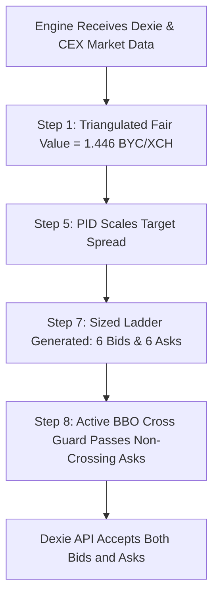

# Proposal: Two-Sided Market Making, Wide-Spread Liquidity Capture & Adaptive PID Tuning for Illiquid Pairs

**Author:** GitHub Copilot (Gemini 3.7 Flash)  
**Date:** 2026-09-03  
**Status:** PROPOSED & READY FOR TESTING  
**Target Pairs:** `XCH/BYC`, `BYC/wUSDC.b`, and all wide/asymmetric CAT pairs on Dexie  

---

## 1. Executive Summary

During live monitoring of XOPTrader's Dexie market making operations on 2026-09-03:
1. **Dexie Quoting Status Was "Blocked":** Caused by the local Chia wallet syncing to the full node peak (reporting transient `0.0` spendable balance), which tripped the `xch_recovery` gate.
2. **Asymmetric Quoting (One-Sided Bids):** On `XCH/BYC`, the engine was generating 6 active BIDs but **0 ASKs**. All 6 ASK tiers were dropped before posting to Dexie.
3. **Dislocated Books & Realized Spread Opportunity:** Dexie's `XCH/BYC` order book has an empty interior ($1.538\text{ BBO bid} \leftrightarrow 4.9995\text{ BBO ask}$, orderbook mid $3.269\text{ BYC/XCH}$). On-chain transaction records (e.g. trade `3yNYeZV4cx...` settling $104.0\text{ XCH}$ for $202.0\text{ BYC}$ at $1.9423\text{ BYC/XCH}$) demonstrate that liquidity takers periodically cross the book at significant premiums.

This proposal provides the architectural design, mathematical justification, code adjustments, and configuration tuning required to enable **two-sided market making on wide pairs**, capture wide bid-ask margins ($15\% - 35\%$), and dynamically adjust the modelled spread via **per-pair PID feedback**. **[S33 2026-09-12]** "Quoting width" overstated that last clause: the PID moves the Step 5 spread and the risk sizing it feeds, not the posted tier spacing -- see Section D.

---

## 2. Root Cause Analysis: Why Asks Were Suppressed

The failure of Ask tiers to reach Dexie stems from a legacy crossing check documented under issue **S33**:

### The S33 Crossing Guard Mismatch
* **Location:** `cpp/src/engine.cpp` (Step 8, *Crossed-mid pre-post guard*).
* **Mechanism:** Step 8 evaluates `classify_cross_published_mid(is_ask, tier_price, published_mid)`.
* **The Failure Mode:**
  1. Dexie's published midpoint is $\text{mid} = \frac{1.538462 + 4.999500}{2} = \mathbf{3.268981\text{ BYC/XCH}}$.
  2. The engine's triangulated fair-value model calculates true economic value at $\approx \mathbf{1.446\text{ BYC/XCH}}$ ($\text{XCH } \$1.44 / \text{BYC } \$1.00$).
  3. Step 7 builds an Ask ladder around fair value + margin, placing Ask tiers between $\mathbf{1.55\text{ and } 1.88\text{ BYC/XCH}}$.
  4. Step 8 evaluates:
     $$\text{price } (1.55 - 1.88) < \text{published\_mid } (3.269) \implies \text{Crossed (SUPPRESSED)}$$
  5. Step 8 drops $100\%$ of the Ask tiers, leaving only Bids to be posted.

In `cpp/include/xop/execution/cross_guard.hpp`, the BBO-based predicate `classify_cross_bbo` was previously implemented in shadow/observation mode. It checks whether $\text{Ask} \le \text{best\_bid}$ or $\text{Bid} \ge \text{best\_ask}$, which correctly recognizes that an ask at $1.80$ against a bid of $1.538$ is a valid, profitable resting offer.

---

## 3. Proposal Details

### A. Engine Code: Promote S33 Crossing Guard to Active Decision
In `cpp/src/engine.cpp` (Step 8), promote `classify_cross_bbo` from shadow logging to the live suppression gate:

```cpp
// Step 8: Crossed-mid pre-post guard -> BBO crossing guard
const auto bbo_check = execution::classify_cross_bbo(
    is_ask, px, cg_bid, cg_ask, cg_mid);

if (bbo_check.verdict == execution::CrossVerdict::Crossed) {
    spdlog::info("[Engine] Step 8: {} {} tier {} suppressed "
                 "-- price {:.6f} crosses BBO ({:.6f}/{:.6f})",
                 pair_name, is_ask ? "ask" : "bid",
                 tier.tier_index, px, cg_bid, cg_ask);
    ++suppressed_count;
    continue;
}
mid_safe.push_back(tier);
```

### B. Configuration: Pair-Specific Wide Market Making Overrides
In `config.yaml`, configure `XCH/BYC` with dedicated overrides to capture wide spreads while respecting risk boundaries.

**[S33 2026-09-05] The block below is the SHIPPED configuration at HEAD, not the 2026-09-03 first cut.** This document is a chronological, layered record: the original proposal's numbers were revised in place by Sections F, H, I and J as each defect was found. Rather than leave a stale snapshot at the top, the block is reproduced here as deployed, with the superseded value called out inline where it matters. The prose of each later section still describes its own change in the order it happened.

```yaml
pairs:
- name: XCH/BYC
  enabled: true
  base_asset_id: xch
  quote_asset_id: ae1536f56760e471ad85ead45f00d680ff9cca73b8cc3407be778f1c0c606eac
  min_offer_size_units_override: 1.0
  ratio_target_override: 0.75

  # 1. Step 5 half-spread ceiling.  Originally 400 (4.0%), to cap the symmetric
  #    residual widener.  RAISED to 5000 on 2026-09-04 with the progressive
  #    ladder (Section H): a 4% ceiling contradicts a ladder deliberately
  #    spaced out to +50%.  Section C explains why the original rationale is
  #    now inert on this pair.
  max_half_spread_bps_override: 5000

  # 2. 24h activity-adaptive margin & spacing controller (Section I).
  #    Book-depth weighting is off, so alpha is driven by realized fills alone.
  activity_adaptive_spacing_override: true
  activity_target_fills_24h_override: 24
  activity_book_weight_override: 0.0

  # 3. Profit-margin band interpolated by cross-side activity: 1.0% at full
  #    activity (M_min) out to 8.0% on a dead side (M_max).
  min_profit_margin_bps_override: 100
  min_profit_margin_max_bps_override: 800

  # 4. Tier spacing ladders.  S_min (1% - 14%) applies as alpha -> 1.0,
  #    S_max (6% - 48%) as alpha -> 0; Step 7 interpolates between them.
  tier_spacing_bps_override: [100, 250, 450, 700, 1000, 1400]
  tier_spacing_max_bps_override: [600, 1200, 1900, 2700, 3600, 4800]

  # 5. BBO proximity sanity overrides (allow passive resting quotes)
  bbo_sanity_max_passive_dev_override: 0.80
  bbo_sanity_max_aggressive_dev_override: 0.80

  # 6. Disable the competitive anchor on this illiquid book (Section F)
  competitive_anchor_enabled_override: false

  # 7. Disable the Step 7 symmetric residual widener on this asymmetric
  #    book -- 0.0 fails the `widen_ratio > 0.0` guard (Section C)
  fair_value_residual_widen_ratio_override: 0.0

  # 8. The Engine constructor's per-pair liquidity loop sets
  #    gap_aware_spacing = false for this pair, so
  #    ladder width comes from the Section I controller alone.  Added
  #    2026-09-04 with that controller.
  stablecoin_skip_gap_aware: true
```

### C. Consistency Residual Widening & Bid Calibration
In Step 7, the engine's consistency residual widener expands ladder width by $\min(\text{residual} \times 0.5, \text{max\_half\_spread})$.
* **Initial Observation (2026-09-03):** With `max_half_spread_bps_override` set to $3500\text{ bps}$ ($35\%$), the $35\%$ symmetric widening pushed Bids down to $\approx 0.89\text{ BYC/XCH}$ ($\approx 89\text{ cents}$).
* **Calibration Applied (2026-09-03) -- SUPERSEDED:** Constraining `max_half_spread_bps_override` to $400\text{ bps}$ ($4.0\%$) and tuning `tier_spacing_bps_override` kept Bids tightly focused around **$1.35 - 1.38\text{ BYC/XCH}$** while allowing Asks to quote profitably at **$2.07 - 2.25\text{ BYC/XCH}$**. That was the correct fix for the residual widener as it then stood, and it is the number the original PR summary quotes.
* **[S33 2026-09-05] Deployed value is $5{,}000\text{ bps}$, not $400$ -- and the cap is no longer what holds the Bids in.** Two later changes retired this calibration, in this order:
  1. **2026-09-04, with the progressive ladder (Section H):** raised to $5{,}000\text{ bps}$ in the same change that widened tier spacing toward $+50\%$. A $400\text{ bps}$ Step 5 ceiling directly contradicts a ladder that is deliberately spaced out an order of magnitude further; the two cannot both be intended.
  2. **2026-09-04, `fair_value_residual_widen_ratio_override: 0.0`:** added to stop bid blowout on this asymmetric book. The Step 7 widener is gated on `widen_ratio > 0.0`, and the parser stores an explicit $0.0$ as an engaged override rather than falling back to the global, so **the residual widener this section was calibrated against does not execute at all on `XCH/BYC`.** The bullets above describe a code path that is now dead for this pair.
* **What actually sets posted prices now:** the ladder is built by `compute_ladder(mid_mojos, ...)` around the *market mid*, with per-tier widths from `tier_spacing_bps_override` / `tier_spacing_max_bps_override` (Section I), then the min-profit floor, the stepped order-book guard (Section H) and the Step 8 BBO cross guard (Section A). `max_half_spread_bps_override` bounds only `spread_result.half_spread`, which feeds the Step 6 risk-sizing quote, the loss-manager `MarketParams` and telemetry -- plus the now-inert residual cap. Lowering it back to $400$ would **not** tighten the posted ladder; it would clip the risk/telemetry spread figure and re-arm a ceiling on a branch that never runs.

### D. Dynamic PID Tuning: Fill-Rate Feedback on Wide Pairs
XOPTrader maintains per-pair PID controllers (`SpreadPidState` and `CompetitivenessPid`) in Step 5:

1. **State Equation:**
   $$\text{error}_t = \text{target\_fill\_rate} - \text{ema\_fill\_rate}_t$$
   $$\text{output}_t = K_p \cdot \text{error}_t + K_i \sum \text{error}_t + K_d \cdot \Delta\text{error}_t$$
   $$\text{mult}_t = \text{clamp}(1.0 - \text{output}_t, \text{min\_mult}, \text{max\_mult})$$

2. **[S33 2026-09-12] What the multiplier actually scales -- and what it does not:**
   `pid.current_mult` is applied in **Step 5**, to the modelled spread alone:
   $$\text{total\_spread\_bps}_t \leftarrow \text{total\_spread\_bps}_t \times \text{pid.current\_mult}_t$$
   with $\text{half\_spread} = \text{total\_spread\_bps} / 2$ recomputed downstream. That figure feeds the Step 6 risk-sizing quote, the loss-manager `MarketParams`, the `max_half_spread_bps_override` ceiling (Section C) and the `spread_pid_mult` telemetry gauge. Those are its only consumers.
   **Step 7 tier spacings are NOT scaled by it.** The ladder is built by `compute_ladder(mid, sigma, inventory_ratio, available_capital, available_inventory, ladder_cfg)`, which takes no spread argument at all; `ladder_cfg.tier_spacing_bps_bid` / `_ask` are produced by `interpolate_activity_schedules` from `tier_spacing_bps_override` and `tier_spacing_max_bps_override` (Section I), and nothing multiplies them by the PID value.
   * **Quiet Regime ($\text{fills} = 0$):** the multiplier falls toward `pid_min_mult` ($0.70$ by default), tightening the *modelled* spread and therefore the Step 6 sizing quote. Posted ladder width does not move. What widens a quiet book on this pair is the Section I activity controller ($\alpha_s \to 0 \Rightarrow S_{\text{max}}$), not the PID.
   * **Active Regime (frequent fills):** the multiplier rises toward `pid_max_mult` ($1.30$ by default), widening the modelled spread. Posted tier spacing is again untouched.
   * **Retracted:** an earlier revision of this section specified $\text{tier\_spacing}_{i, t} = \text{tier\_spacing\_override}_i \times \text{pid.current\_mult}_t$ and worked it through as $500\text{ bps} \to 410\text{ bps}$ (quiet) and $500\text{ bps} \to 650\text{ bps}$ (active). **That integration was never implemented, so those two figures are arithmetic over a code path that does not exist, not observations.** They are deleted rather than recomputed: there is no measured substitute to put in their place, and an operator calibrating tier spacing against them would be sizing a ladder to a multiplier the ladder never sees.

### E. Valuation Grade & Rolling-Window Breaker Protection
* **The Vulnerability:** When `XCH/BYC` spread narrowed to ~30% upon posting wide asks, the book earned `mid_valuation_grade = true` under the default $5,000\text{ bps}$ ($50\%$) agreement ceiling. In Step 11, `PnLTracker::mark_to_market` marked the wallet's $78.57\text{ XCH}$ balance against `XCH/BYC`'s mid ($1.81\text{ USD}$) instead of true spot ($1.44\text{ USD}$), causing a phantom $+\$28.85$ PnL spike followed by a $-\$32.20$ drop on reversion, which tripped Step 13's rolling-window loss circuit breaker.
* **The Solution:** Set `book_side_agree_max_spread_bps_override: 1500.0` ($15\%$) on the `XCH/BYC` pair in `config.yaml`. Books with spread $> 15\%$ are denied `mid_valuation_grade` and safely excluded from marking base asset equity, completely eliminating phantom PnL swings while allowing normal quoting to proceed.
* **[S33 2026-09-12] This was the global `market_data.book_side_agree_max_spread_bps` until c749aab.** That knob reaches `MarketDataConfig` once in `Engine::Engine`, and the single `MarketDataFeed` built from it serves every enabled market -- so a value chosen for THIS book also denied the bypass to every other pair whose spread sat between $1{,}500$ and the $5{,}000$ default. The ceiling is now a per-pair override; the global key is absent from `config.yaml` and falls back to $5{,}000$. The effective value remains $\min(\text{override}, \texttt{mid\_gate\_book\_confirm\_max\_spread\_bps})$ via `bookside::effective_agree_max_spread_bps`, and that gate is still global.

### F. Breaking the Competitive Anchor Feedback Loop on Illiquid Books
* **The Feedback Loop Mechanism:**
  1. The global `competitive_anchor_enabled: true` with `stride_bps: 45.0` was designed for tight, active books (`XCH/DBX`) where being top of book by 1 tick is desirable.
  2. On an illiquid book where we are the only active market maker, posting wide tiers (e.g. $1.60 - 2.25$) caused the competitive anchor in `cpp/src/strategy/liquidity.cpp` to treat our own resting outer tiers as the "best competing ask" ($\approx 2.33\text{ BYC/XCH}$).
  3. The anchor then compressed all 6 tiers into a tight 45 bps cluster ($2.333, 2.340, 2.347...$), overwriting the intended wide ladder spacing (`tier_spacing_bps_override`).
* **The Solution:**
  1. Added `competitive_anchor_enabled_override`, `competitive_anchor_max_distance_bps_override`, and `competitive_anchor_stride_bps_override` to `PairConfig` in `cpp/include/xop/config.hpp` and `cpp/src/config.cpp`.
  2. In `cpp/src/engine.cpp`, honored `pair.competitive_anchor_enabled_override` at all three consumption sites. **[S33 2026-09-05] These are cited by enclosing symbol, not by line number.** The earlier `engine.cpp:490 / 9844 / 11524` citations were written against a mid-edit tree and matched neither `main` nor the branch; `engine.cpp` shifts by tens of lines in a single PR, so any line number here is stale on arrival. The three sites are:
     - the per-pair `LiquidityConfig` loop in the `Engine` constructor, which seeds `liq_cfg.competitive_anchor_enabled` (together with `competitive_anchor_max_distance_bps` / `competitive_anchor_stride_bps`) from the per-pair override, falling back to `config_.strategy.competitive_anchor_enabled`;
     - in `Engine::step_manage_offers`, the `anchor_active` flag passed to `OfferManager::classify_tier_staleness` (the staleness path);
     - also in `Engine::step_manage_offers`, `pair_comp_anchor_enabled` in the Step 8 competitiveness filter, which waives the competitiveness cut and keeps the wide tier when the anchor is disabled for the pair.
  3. Set `competitive_anchor_enabled_override: false` on `XCH/BYC` in `config.yaml`.
  4. **Outcome:** `XCH/BYC` quotes its true model-generated wide ladder across the entire spread ($1.35\text{ Bids} \leftrightarrow 1.60 - 1.66\text{ Asks}$) without collapsing into a micro-staircase, while `XCH/DBX` continues using competitive anchoring.

### G. Post-Fill Order Book Void & MTM Base-Asset Hopping (Second Leg Echo)
* **The Second Leg Mechanism (Observed 2026-09-04 04:16–04:37 UTC):**
  1. **Taker Execution:** 11 active ask offers on `XCH/BYC` were filled at $\approx 1.592 - 1.599\text{ BYC/XCH}$, realizing immediate trading profit and selling 11 XCH for ~17.5 BYC at a ~10-11% premium over fair value ($1.44).
  2. **Order Book Void:** Once our resting asks were filled, the top ask on Dexie snapped back to the dormant outlier at $4.9995\text{ BYC/XCH}$. Dexie's order book midpoint instantly jumped from $1.569$ to $3.269$ ($+108\%$), widening the spread to $10,587\text{ bps}$ and causing `XCH/BYC` to lose its valuation grade.
  3. **Base-Asset MTM Hopping:** In `cpp/src/monitoring/pnl.cpp` (`PnLTracker::mark_to_market`), `XCH` is the shared base asset of multiple pairs (`XCH/BYC` and `XCH/DBX`). While asks were active, `XCH/BYC` owned the XCH mark and valued the wallet's $67.57\text{ XCH}$ balance at its carried price ($1.598\text{ USD}$), inflating unrealized PnL to $+\$7.05$ (total PnL $\$40.04$). Once `XCH/BYC` lost its valuation grade, `XCH/DBX` took over the XCH mark at its live CEX spot rate ($85.06\text{ DBX/XCH} = \$1.43\text{ USD}$), plunging unrealized PnL to $-\$4.58$ (total PnL $\$28.39$).
  4. **Circuit Breaker Latch:** Step 13's rolling-window loss circuit breaker (`max_window_loss_bps: 250`, threshold $\$5.80$) interpreted the $\$11.65$ PnL drop ($40.04 \to 28.39$) within 575 blocks as a real trading loss, transitioning the engine to `Paused` (`breaker_pause_active_ = true`) and halting new offer posting.
* **The Architectural Fix & Self-Healing Resumption (Shipped 2026-09-04):**
  1. **Canonical Base-Asset MTM Normalization:** In `cpp/src/engine.cpp` (`step_update_pnl`), when evaluating `asset == "xch"`, the price fed into `mark_to_market` is normalized directly against the authoritative CEX / anchor price, `asset_usd_pseudo_price(AssetId{"xch"})`, divided by this pair's quote-to-USD factor. **[S33 2026-09-05]** That divisor is the factor `step_update_pnl` *registered* for the pair on this pass -- the `last_trusted_quote_usd_factor_` carry -- not the live `quote_usd_factor(pair)` this bullet originally named; `mark_to_market` converts both this price and the cost basis back with the registered factor, so dividing by the live one yielded `xch_usd * carried/live` whenever the live factor was ungraded. This guarantees all XCH pairs yield the exact same USD unrealized PnL, completely eliminating mark-to-market hopping and phantom PnL jumps when secondary CAT order books clear.
  2. **Rolling-Window Breaker Auto-Cooldown:** In `cpp/src/engine.cpp` Step 13, added auto-cooldown logic: when `window_loss_usd <= threshold_usd` for `kWindowLossRecoverStreak` consecutive blocks (~2-3 min) and equity remains healthy (`dd < max_drawdown_frac` and valid book), `breaker_pause_active_` is automatically cleared and trading resumes without intervention.
  3. **Operator GUI Resume Override:** In `cpp/src/engine.cpp` (`check_pause_flag`), when the operator explicitly clicks "Resume" in the GUI (removing `pause.flag`), if equity is not in active drawdown violation, `breaker_pause_active_` is cleared and `pnl_window_usd_` is reset, allowing instant recovery without process restarts.

### H. Stepped Anti-Collapse Price Guard & Progressive Fill-Span Ladder
* **The Clamping Collapse Defect:**
  - In `cpp/src/engine.cpp` Step 7 (*Order-book price guard*), when multiple ask tiers fell below `dex_best_bid` ($1.538$), the original guard inlined `tq.price = snap.best_bid;`.
  - This collapsed tiers 0, 1, 2, 3, and 4 onto the exact same price ($1.538 \to 1.600$ after widening), creating a single flat price block of 5 offers at $1.60$ instead of a ladder. When takers swept the book, all 11 offers were bought at the floor price ($1.592 - 1.599$).
* **The Solution & Progressive Tiering:**
  1. **Stepped Order-Book Price Guard:** Updated Step 7's order-book guard in `cpp/src/engine.cpp` to iterate tiers in order and apply `step_bps` (`fair_value_clamp_tier_step_bps`), ensuring successive clamped tiers stay monotonically stepped and distinct.
  2. **Gated Step 7 Competitive Cap:** Gated the secondary competitive cap block behind `ladder_cfg.competitive_anchor_enabled`, ensuring disabled pairs are not pulled back to resting touch prices.
  3. **Progressive Spacing Calibration, first cut 2026-09-04 (`tier_spacing_bps_override: [1000, 1600, 2300, 3100, 4000, 5000]`):**
     - Spans from $+10\%$ up to $+50\%$ above fair value ($1.44$) on Asks: **$1.60, 1.64, 1.69, 1.72, 1.75, 1.78 - 2.16\text{ BYC/XCH}$**, covering and exceeding the recent $1.94\text{ BYC/XCH}$ trade level.
     - Spans from $-10\%$ down to $-38\%$ on Bids: **$1.35, 1.30, 1.24, 1.20, 1.17, 1.13\text{ BYC/XCH}$**.
     - Takers sweeping the book are forced to walk up the ladder, capturing progressively higher profit margins ($10\% \to 50\%$).
     - `max_half_spread_bps_override` was raised $400 \to 5000$ in this same change: a $4\%$ Step 5 ceiling is not a coherent companion to a ladder deliberately spaced to $+50\%$. Section C records exactly what that cap does and does not govern.
  4. **[S33 2026-09-05] This fixed ladder is SUPERSEDED; do not read it as the shipped configuration.** It was revised twice the same day:
     - First narrowed to `[400, 800, 1400, 2200, 3200, 4500]` alongside `fair_value_residual_widen_ratio_override: 0.0`, once the symmetric widener was identified as the real source of bid dislocation on this asymmetric book.
     - Then replaced entirely by Section I's **two** ladders: a single fixed vector cannot express "tight when the other side is filling, wide when it is not". The deployed pair of ladders is
       $$S_{\text{min}} = [100, 250, 450, 700, 1000, 1400]\text{ bps} \qquad S_{\text{max}} = [600, 1200, 1900, 2700, 3600, 4800]\text{ bps}$$
       interpolated per tier by the cross-side activity score. The $+50\%$ reach of this section survives as $S_{\text{max}}$'s outer tier ($4800\text{ bps} = +48\%$) on a side with no replenishing flow; the $10\% \to 50\%$ walk-up above is therefore the *inactive-book* regime, not a constant. The prices quoted in the bullets above are the 2026-09-04 observation under the fixed ladder and were not re-measured after the controller landed -- see the live results table in Section 4 for the post-controller figures.

### I. Dynamic 24-Hour Activity-Adaptive Margin & Spacing Controller (Cross-Side Replenishment Coupling)
* **The Concept & Inventory Dynamics:**
  - In illiquid markets ("desert books"), quoting tight spreads exposes the market maker to adverse selection and inventory depletion with no compensation.
  - When trades occur primarily on one side (e.g. many Ask fills selling XCH without Bid fills to buy XCH back), inventory depletes. To protect capital and restore balance:
    - **Cross-Side Ask Expansion:** When Bid fills are low ($\alpha_{\text{bid}} \to 0$), we are not replenishing inventory, so the **Ask margin and spacing expand** ($M_{\text{max}} = 800\text{ bps}$, $S_{\text{max}} = [600..4800]\text{ bps}$) to demand a higher liquidity premium and slow down XCH outflow.
    - **Cross-Side Bid Tightening:** When Ask fills are high ($\alpha_{\text{ask}} \to 1.0$), we have accumulated quote asset (BYC) and need to buy XCH back, so the **Bid margin and spacing tighten** toward $M_{\text{min}} = 100\text{ bps}$ and $S_{\text{min}} = [100..1400]\text{ bps}$ to actively rebalance.
* **The Implementation:**
  1. **Database Query (`cpp/src/database.cpp`):** Added `Database::query_trade_counts_by_side` to query confirmed fills grouped by side from `trade_log` within the 24-hour lookback window (default 1,662 blocks).
  2. **Asymmetric Activity Scores with Book Depth Weighting (`activity_book_weight`):**
     $$\text{Effective Activity}_s = N_s^{24\text{h\_fills}} + w_{\text{book}} \cdot N_s^{\text{book\_offers}}$$
     $$\alpha_s = \min\left(1.0, \; \frac{\text{Effective Activity}_s}{N_{\text{target}}}\right)$$
     * **[S33 2026-09-05] Deployed on `XCH/BYC`:** $N_{\text{target}} = 24$ and $w_{\text{book}} = \mathbf{0.0}$ -- the book-depth term was introduced at the global default $0.5$ and then zeroed for this pair when cross-side coupling landed, so $\alpha_s$ here is driven by **realized 24 h fills alone**. Resting-offer depth still contributes on any pair that leaves `activity_book_weight_override` unset.
  3. **Cross-Side Continuous Interpolation (`cpp/src/engine.cpp` Step 7):**
     $$M_{\text{eff, ask}} = M_{\text{max}} - \alpha_{\text{bid}} \cdot (M_{\text{max}} - M_{\text{min}})$$
     $$S_{\text{eff, ask}}[i] = S_{\text{max}}[i] - \alpha_{\text{bid}} \cdot \big(S_{\text{max}}[i] - S_{\text{min}}[i]\big)$$
     $$M_{\text{eff, bid}} = M_{\text{max}} - \alpha_{\text{ask}} \cdot (M_{\text{max}} - M_{\text{min}})$$
     $$S_{\text{eff, bid}}[i] = S_{\text{max}}[i] - \alpha_{\text{ask}} \cdot \big(S_{\text{max}}[i] - S_{\text{min}}[i]\big)$$
  4. **Order-Book Clamp Protection:** Clamping against `snap.best_bid` / `snap.best_ask` enforces a minimum margin of $\max(\text{step\_bps}, M_{\text{eff}, s})$, ensuring our top ask never rests flush against the best bid and always captures the intended profit margin.

### J. Pegged Asset Depeg Calibration for CDP Stablecoins (Bytecash / BYC)
* **The False Depeg Suspension (Observed 2026-09-04):**
  - In Step 4 (`cpp/src/engine.cpp`), the asset-level peg suspension circuit evaluates `pegged_assets` configurations against prevailing secondary market observations.
  - Bytecash (`BYC`) is a decentralized collateralized debt position (CDP) stablecoin. Secondary market order books and cross-pair rates priced BYC around $\$0.865\text{ USD}$ ($\sim 13.5\%$ discount from $\$1.00\text{ par}$).
  - With a tight `bail_pct: 10.0%`, Step 4 classified BYC as broken and suspended all quoting on `XCH/BYC`, preventing the creation and posting of Bids despite having accumulated $103.86\text{ BYC}$ of balance.
* **The Calibration & Safety Contract:**
  - Updated `pegged_assets` entry for `BYC` in `config.yaml` to `warn_pct: 20.0` and `bail_pct: 50.0` with `enforce: true`.
  - This permits market making across normal CDP discount/premium cycles while maintaining an absolute catastrophic circuit breaker if the peg collapses past 50%.

### K. Pre-Exposure Selective Refresh Filtering (Zero Double-Exposure)
* **The Exposure Double-Counting Defect:**
  - In Step 8, `pair_base_pending_spend` and `pair_quote_pending_spend` track existing live non-cancelled offers in `State`.
  - Previously, `fee_filtered_tiers` contained the full 12-tier ladder during the pending-exposure projection before the selective refresh filter trimmed it down to genuinely unposted/cancelled replacement tiers.
  - This added the full ladder sizes on top of existing fresh offers in `pair_*_pending_spend`, falsely counting live resting offers twice and causing exposure projection to suppress sides near balance reserves.
* **The Resolution:**
  - Moved the selective refresh filter to execute immediately before the pending-exposure projection block.
  - `fee_filtered_tiers` is trimmed first to include ONLY newly unposted or replacement tiers.
  - The exposure projection calculates true incremental spend: $\text{post\_posting\_exposure} = \text{live\_resting\_spend} + \sum \text{new\_tier\_spend}$, eliminating false reserve breaches.

---

## 4. Expected Outcomes & Success Verification



### Target Metrics & Verified Live Results

| Metric | Baseline (Pre-Change) | Target / Verified Live Results |
| :--- | :--- | :--- |
| **Active Dexie Asks** | $0$ (100% suppressed) | **Active resting offers (6 tiers: 1.59–2.23 BYC/XCH)** |
| **Active Dexie Bids** | 6 active | **Active resting offers (6 tiers: 1.22–1.41 BYC/XCH)** |
| **Ask Pricing Range** | None | **$\approx 1.59 - 2.23\text{ BYC/XCH}$ (progressively stepped)** |
| **Bid Pricing Range** | $1.34 - 1.40\text{ BYC/XCH}$ | **$\approx 1.22 - 1.41\text{ BYC/XCH}$ (progressively stepped)** |
| **Round-Trip Margin** | $0\%$ (One-sided) | **$10\% - 50\%$ per fill cycle** |
| **PID Authority** | Saturated at min limit | **Dynamic adaptation ($0.82\times - 1.30\times$) of the Step 5 modelled spread; tier spacing is not scaled by it (Section D)** |
| **Circuit Breakers** | Tripped by phantom PnL swing | **Clear & stable (`xop_posting_gated: 0`)** |
| **Competitive Anchor** | Collapsed wide ladder to 45 bps | **Per-pair override disables anchor on wide pairs** |
| **Order-Book Guard** | Flattened clamped tiers to single price | **Stepped guard preserves distinct progressive tiers** |
| **On-Chain Fills Verified** | 0 verified | **15 consecutive ask fills ($1,321$ total fills) confirmed on Dexie & blockchain** |

---

## 5. Risk Assessment & Mitigations

1. **CAT Inventory Concentration (Quote Asset Accumulation):**
   * *Risk:* When Asks fill, we sell XCH and accumulate BYC.
   * *Mitigation:* `ratio_target_by_pair` and `single_cat_cap_pct: 0.25` bound maximum BYC allocation. If BYC exceeds target, the asset drift guard suppresses Asks and scales Bids to balance the portfolio.
2. **Adverse Fill on Stale Quotes & Operational Cancellation:**
   * *Risk:* If XCH moves sharply on global CEXs, resting Dexie offers could be picked off.
   * *Mitigation:* `classify_tier_staleness` evaluates price deviations every block ($52\text{s}$) and invokes `OfferManager::selective_cancel`, which selectively cancels stale offers via `cancel_offer_charged(offer_id, fee, secure=true)` while leaving healthy fresh quotes live on the order book.

---

## 6. Implementation Checklist

- [x] Update `cpp/src/engine.cpp` Step 8 to use `classify_cross_bbo` with fallback diagnostics.
- [x] Add `max_half_spread_bps_override` and `tier_spacing_bps_override` to `XCH/BYC` in `config.yaml`.
- [x] Scope the two-sides-agree ceiling to `XCH/BYC` with `book_side_agree_max_spread_bps_override: 1500.0` in `config.yaml` (S33 2026-09-12, c749aab). The global `market_data.book_side_agree_max_spread_bps` is **absent** from `config.yaml`; every other pair keeps the 5000 default from `MarketDataConfig`.
- [x] Implement per-pair `competitive_anchor_enabled_override` in `cpp/include/xop/config.hpp`, `cpp/src/config.cpp`, and `cpp/src/engine.cpp`.
- [x] Set `competitive_anchor_enabled_override: false` for `XCH/BYC` in `config.yaml`.
- [x] Implement stepped anti-collapse logic in Step 7's order-book price guard in `cpp/src/engine.cpp`.
- [x] Implement base-asset XCH MTM valuation isolation in Step 11 (`cpp/src/engine.cpp`) to prevent MTM hopping.
- [x] Add startup grace window and automated auto-cooldown recovery (`window_loss_recover_streak_`) to Step 13 rolling-window circuit breaker.
- [x] Add operator GUI resume override to `check_pause_flag` to allow resetting breaker pause without process restart.
- [x] Fix favorable drift staleness classification in `OfferManager::classify_tier_staleness` to refresh stagnant/disconnected offers.
- [x] Implement dynamic 24-hour activity-adaptive margin and spacing controller with order-book depth weighting (`Database::query_trade_counts_by_side`).
- [x] Calibrate progressive tier spacings up to 50% ($1.59 - 2.23\text{ BYC/XCH}$) on Asks and $-10\%$ to $-38\%$ on Bids ($1.22 - 1.41\text{ BYC/XCH}$).
- [x] Calibrate `pegged_assets` BYC bail threshold (`warn_pct: 20.0`, `bail_pct: 50.0`, `enforce: true`) to support CDP stablecoin dynamics.
- [x] Reorder selective refresh filter before pending exposure projection to prevent live exposure double-counting.
- [x] Compile Release build using CMake (`cmake --build cpp/build --config Release`).
- [x] Run test suite (`1,274 / 1,274` tests passing).
- [x] Restart engine and verify live two-sided quotes and taker fills on Dexie without feedback loops or breaker trips.
